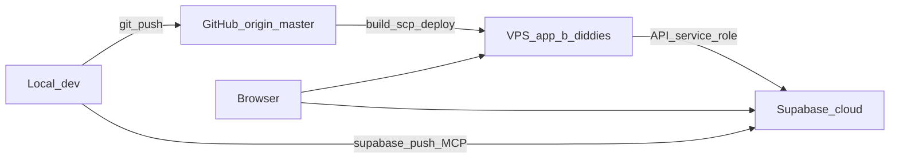

# TradePro / Builder Diddies — Application Master Audit

**Audit date:** 2026-07-15 (evening UK)  
**Method:** Code walk → live probes → then cross-check existing docs (never the reverse).  
**Purpose:** Single place to open before searching the codebase. Update markers when shipping.

---

## How to use this document

1. Start here for “what exists / where / is it live?”
2. **§§1–15** = infrastructure layers + maps. **§§16–22** = deep-dives (voice, tools, WhatsApp, setup books).
3. **§§23–25 (Part C)** = coverage matrix + Feature Location Atlas + API catalogue.
4. **§§27–28 (Part D)** = Flutter / mobile + how-it-works for former gaps (additive).
5. Status markers are authoritative for this audit date; re-probe VPS/Supabase after major deploys.
6. When you add a feature: update §23 matrix, §24 atlas row, and §25 API line in the same session.

### Status markers

| Marker | Meaning |
|--------|---------|
| `LIVE` | Present in code and verified on the expected runtime (or clearly production-wired) |
| `PARTIAL` | Exists but incomplete, mock-backed, or feature-flag / role-gated |
| `LEGACY` | Code exists but is not the source of truth |
| `GITHUB_ONLY` | On `origin/master` (or local+GH) but **not** on VPS and/or not on Supabase |
| `VPS_ONLY` | Present on VPS but missing from local/`origin/master` (rare drift) |
| `SUPABASE_ONLY` | Present in cloud schema but missing from local migrations (rare drift) |
| `PLANNED` | Registry stub / “future” wording only |
| `DO_NOT_SHIP` | Local scratch, session data, secrets, Playwright artifacts |

---

## 1. Three layers — verified now

Pushing GitHub alone never refreshes the live site. Migrations never deploy the SPA or Node API.



### 1A — GitHub

| Repo | Local path | Remote | Branch | Local HEAD = `origin/master` |
|------|------------|--------|--------|------------------------------|
| Frontend | `Bathroom Sales Estimation Platform` | `https://github.com/dolab-jpg/tradepro-frontend.git` | `master` | **YES** `@ 9f36243` (tip may include follow-up for this table) |
| Backend | `tradepro-backend` | `https://github.com/dolab-jpg/tradepro-backend.git` | `master` | **YES** `@ 2249837` |

**Frontend tip commit:** `1258bc4` (feature `9f36243`) — Unify Cynthia across staff/web/phone channels; Vapi-only phone branding; `cynthia-widget.js`; Call Centre Cynthia copy.

**Backend tip commit:** `2249837` — Cynthia phone prompts; Vapi-only gates; no sip-bridge rollback; VAPI_SIP.md + sip-bridge README updated.

**Ship note (2026-07-15 Cynthia unify):** Cyrus + Aria collapsed into **Cynthia channels** (§4.1). Phone AI is Vapi-only; `/api/cyrus/*` + `cyrus-widget.js` remain transport aliases; new embeds use `cynthia-widget.js`.

**DO_NOT_SHIP:** `.cursor/local/*.py`, `debug-login.png`, `playwright-report/`, `test-results/`, backend `server/data/*`, `_patch_*.cjs`, `_tmp_*.cjs`, `tmp-aria-lizzie.mp3`.

### 1B — VPS (`https://app.b-diddies.com`)

Host SSH: `vps` → `mail.all1house.com`.

| Check | Result |
|-------|--------|
| SPA docroot | `/var/www/vhosts/b-diddies.com/app.b-diddies.com/` |
| Live bundles | `assets/index-CET7sGhh.js` + `assets/index-CEERq7t0.css` |
| Local `dist/` | **Same hashes** (built ~2026-07-15 20:38 UTC) |
| Title in live HTML | Builder Diddies — Construction Estimation Platform |
| API unit | `tradepro-api` = **active** |
| API WorkingDirectory | `/var/www/vhosts/b-diddies.com/tradepro-backend` |
| API process | Node 24 + `tsx` → `server/index.ts` (**canonical backend**, not frontend `server/`) |
| VPS backend git SHA | `13f3c71` = local = `origin/master` |
| Env file | `/etc/tradepro-api.env` (key names only listed below) |
| Also on disk | `tradepro-app/` frontend tree; `httpdocs/` marketing site — **SPA users hit `app.b-diddies.com`** |

**HTTP smoke (2026-07-15 evening):**

| Path | Code | Notes |
|------|------|-------|
| `GET /health` | 200 | API up |
| `GET /api/ai/chat` | 405 | Route alive (wrong method) |
| `GET /api/ai/code-fix` | 200 | Self-heal path present |
| `GET /api/org/staff/list` | 200 | Org/staff |
| `GET /api/auth/me` | 401 | Auth gate |
| `GET /api/whatsapp-web/status` | **200** | Was 404 on earlier audit — **now LIVE** |
| `GET /api/whatsapp-web/qr` | **200** | Was 404 — **now LIVE** |
| `GET /api/agent-activity` | 401 | Route present, auth required |
| `GET /webhooks/vapi` | 405 | Webhook wired |
| `GET /webhooks/whatsapp` | 403 | Meta webhook path exists |
| `GET /api/vapi/web-session` | 404 | GET unused — use POST |
| `POST /api/vapi/web-session` | 401 | Route present, auth/session required |
| `GET /api/vapi/health` | 200 | Vapi health OK |

**Env key names on VPS** (values not recorded): `PORT`, `APP_BASE_URL`, `INTEGRATIONS_MOCK_MODE`, `JWT_SECRET`, `ORG_ENCRYPTION_KEY`, `SUPABASE_*`, `OPENAI_API_KEY`, `CURSOR_API_KEY`, `VOICE_PROVIDER`, `TELEPHONY_PROVIDER`, `VAPI_*`, `ELEVENLABS_*`, `SOHO66_*`, `VOICE_*`, `HOME_ORG_ID`, `DEFAULT_ORG_ID`, `GITHUB_TOKEN`, `WEBHOOK_BASE_URL`, …

### 1C — Supabase cloud

| Item | Result |
|------|--------|
| Project ref | `nqdiigfrbxyurpfbufxu` |
| Local migrations | **14** SQL files in `tradepro-backend/supabase/migrations/` |
| Remote migrations | **14** — **exact match** (Management API + `schema_migrations` query) |
| Edge functions (repo) | `platform-orgs`, `stripe-webhook`, `contract-portal` |

Remote versions: `202607090001` … `202607090008`, `202607110001`, `202607140001`, `202607140002`, `202607150001`, `202607160001`, `202607160002`.

---

## 2. System map

| Surface | Role | Canonical home |
|---------|------|----------------|
| React SPA | UI, routing, client engines | Frontend repo `src/` |
| Vite proxy (dev) | `/api/*`, `/webhooks/*` → backend `:3001` | `vite.ai-plugin.ts` |
| Node companion | AI, voice, WhatsApp, mailbox, Stripe, auth helpers | **tradepro-backend** `server/` |
| Frontend `server/` | Old companion copy | **`LEGACY`** — not what VPS runs; do not treat as SoT |
| Supabase | Auth, Postgres, Storage, Edge Functions | tradepro-backend `supabase/` |
| SIP bridge | Unsupported for Cynthia phone AI (historical only) | tradepro-backend `sip-bridge/` — do not use for AI answering |

**Dev ports:** frontend **5174**, backend **3001**. Cynthia phone AI uses Vapi (no local sip-bridge).

**Prod:** SPA + same-origin `/api` + `/webhooks` on `app.b-diddies.com`; browser also talks to Supabase with anon key.

### 2.1 Repos and remotes

| Role | Local path | GitHub | Production surface |
|------|------------|--------|--------------------|
| Frontend (SPA) | `c:\Users\dolab\Downloads\Bathroom Sales Estimation Platform` | `dolab-jpg/tradepro-frontend` → `master` | VPS `.../app.b-diddies.com/` |
| Backend (API + migrations) | `c:\Users\dolab\Downloads\tradepro-backend` | `dolab-jpg/tradepro-backend` → `master` | VPS `.../tradepro-backend/` + systemd `tradepro-api` |
| Mobile (Flutter WebView) | `c:\Users\dolab\Downloads\tradepro-mobile` | `dolab-jpg/tradepro-mobile` → `master` @ `f674a522` | APK/iOS loads `https://app.b-diddies.com` — **§27** |
| Database / Auth | (migrations in backend repo) | via Supabase cloud | Project ref `nqdiigfrbxyurpfbufxu` |

GitHub account: **dolab-jpg**. Auth via Windows Credential Manager (`git:https://github.com`).

---

## 3. Frontend inventory

### 3.1 Public / unauthenticated routes

Source: `src/app/App.tsx`.

| Path | Component | Status |
|------|-----------|--------|
| `/login` | `LoginPage` | LIVE |
| `/signup` | `SignupPage` | LIVE |
| `/forgot-password` | `ForgotPasswordPage` | LIVE |
| `/reset-password` | `ResetPasswordPage` | LIVE |
| `/invite/:token` | `InviteAcceptPage` | LIVE |
| `/contract/:token` | `ContractSignPage` | LIVE |
| `/portal/:token` | `CustomerPortal` | LIVE |
| `/planning-approve/:token` | `PlanningCustomerApproval` | LIVE |
| `/cursor-paste` | `CursorPastePage` | LIVE (agent credential paste for Cursor) |

### 3.2 Authenticated routes (marked)

| Path | Feature | Roles / gate | Primary UI | Status |
|------|---------|--------------|------------|--------|
| `/` | Dashboard | any authed | `Dashboard` | LIVE |
| `/crm` | CRM | super_admin, manager, staff | `ComprehensiveCRM` | LIVE |
| `/customers` | Customers | super_admin, manager, staff | `CustomerManagement` | LIVE |
| `/quote/:tradeId?/:customerId?` | Quote builder | staff+ | `QuoteBuilder` | LIVE |
| `/ai-estimate/:tradeId?/:customerId?` | AI estimate (same builder) | staff+ | `QuoteBuilder` | LIVE |
| `/quote-lines/:customerId?` | Line editor | staff+ | `QuoteLineBuilder` | LIVE |
| `/quotes` | Quotes list | staff+ | `QuotesList` | LIVE |
| `/products` | Catalog | super_admin | `ProductCatalog` | LIVE |
| `/designer` | Bathroom designer | staff+ | `BathroomDesigner` | LIVE |
| `/ai-render/:tradeId?` | AI render | staff+ | `AIBathroomRender` | LIVE |
| `/booking` | Booking | staff+ | `BookingSystem` | LIVE |
| `/site-survey` | Site survey | staff+ | `SiteSurvey` | LIVE |
| `/communications`, `/email` | Comms hub | staff+ | `CommunicationsHub` | LIVE |
| `/cynthia`, `/cynthia/ingest` | Cynthia home | staff+ | `CynthiaHome` | LIVE |
| `/cyrus` | Redirect | — | → `/cynthia` | LIVE |
| `/cyrus/legacy` | Cynthia website/portal threads (legacy inbox UI) | staff+ | `CyrusConversations` | LEGACY UI |
| `/calls` | Call Centre (Cynthia phone) | staff+ | `CallCenter` | LIVE |
| `/agent` | Redirect | — | → `/calls` | LIVE |
| `/integrations` | Integrations hub | super_admin | `IntegrationsHub` | LIVE |
| `/settings` | Settings | super_admin | `Settings` | LIVE |
| `/team` | Team | super_admin | `TeamManagement` | LIVE |
| `/sales` | Sales | super_admin | `SalesManagement` | LIVE |
| `/projects`, `/projects/:projectId` | Projects | (open to authed) | `BuilderProjectManagement` | LIVE |
| `/builder-projects`… | Alias | — | same | LIVE |
| `/builder` | Builder dashboard | builder | `BuilderDashboard` | LIVE |
| `/builder-management` | Builder mgmt | super_admin, manager | `BuilderManagement` | LIVE |
| `/costing` | Costing | super_admin, manager | `CostingDashboard` | LIVE |
| `/price-job` | Job pricing | staff+ | `JobPricing` | LIVE |
| `/approvals` | Approvals | super_admin, manager | `ApprovalsQueue` | LIVE |
| `/contracts` | Contracts | staff+ | `ContractsHub` | LIVE |
| `/changes` | Change orders | (open) | `ChangeOrders` | LIVE |
| `/building-control` | BC hub | staff+, builder | `BuildingControlHub` | LIVE |
| `/planning`, `/planning/:id` | Planning apps | staff+ | `PlanningHub` / detail | LIVE |
| `/finance` | Finance app | staff+ | `FinanceApplication` | LIVE |
| `/portfolio` | Portfolio | (open) | `Portfolio` | LIVE |
| `/recruitment` | Recruitment CRM | `canAccessRecruitment` flag | `RecruitmentCRM` | PARTIAL (flag-gated) |
| `/accounts` | Accounts hub | `canAccessAccounts` flag | `AccountsHub` | PARTIAL (flag-gated) |
| `/platform/clients` | Platform CRM | platform_owner | `PlatformClientsCRM` | LIVE |
| `/ai-audit` | Conversation audit | super_admin, manager | `ConversationAudit` | LIVE |
| `/profile`, `/profile/password` | Profile | any | auth pages | LIVE |

### 3.3 Engine map (`src/app/engine/`)

| Folder | Responsibility | Status |
|--------|----------------|--------|
| `ai/` | Tools, policies, orchestrator, personas, activity, self-heal, facade | LIVE |
| `auth/` | Session store | LIVE |
| `banking/` | Banking + receipts | LIVE / PARTIAL (open banking often mock) |
| `builder/` | Builder store | LIVE |
| `buildingControl/` | BC store/service | LIVE |
| `contacts/` | Contact store | LIVE |
| `contracts/` | Contracts + AI + send + sign effects | LIVE |
| `costing/` | Costing, profit, receipts | LIVE |
| `cynthia/` | Staff Cynthia API client | LIVE |
| `cyrus/` | Website/portal chat clients | LIVE |
| `data/` | Supabase store, cloud persist, import/export | LIVE |
| `integrations/` | Integration store/service, org OpenAI key sync | LIVE |
| `leads/` | Lead + inbox services | LIVE |
| `mailbox/` | Mailbox service | LIVE |
| `messaging/` | Hub, email/WhatsApp, PDFs, templates | LIVE |
| `notifications/` | Notify + store | LIVE |
| `planning/` | Planning store + AI | LIVE |
| `platform/` | Org context, home org, platform API | LIVE |
| `pricing/` | Small jobs + price research | LIVE |
| `project/` | Project store/status/completion | LIVE |
| `projectAi/` | Project AI prompts/service | LIVE |
| `quotes/` | Quote line utils | LIVE |
| `recruitment/` | Recruitment store | PARTIAL |
| `storage/` | File storage abstraction | LIVE |
| `team/` | Team snapshot | LIVE |
| Top-level | `aiChatService`, `aiEstimationService`, `quoteCalculator`, `salesCloseFlow`, `staffAiService`, … | LIVE |

### 3.4 Component clusters (`src/app/components/`)

`accounts`, `AI`, `aiStudio`, `Approvals`, `buildingControl`, `CallCenter`, `Contracts`, `Cynthia`, `integrations`, `JobPricing`, `mailbox`, `planning`, `platform`, `project`, `QuoteBuilder`, `settings`, `ui` (+ many top-level screens: CRM, Dashboard, Settings, …).

### 3.5 Trades config

`src/app/config/trades/`: bathroom, kitchen, plumbing, electrical, roofing, remaining + playbooks/shared/renderOptions.

### 3.6 i18n

Locales: `en`, `es`, `pl`, `ru`, `uk`, `zh`, `fa`, `sq` under `src/app/i18n/`.

### 3.7 Frontend env (browser-safe)

From `.env.example` — only these belong in this repo for runtime:

| Variable | Purpose |
|----------|---------|
| `VITE_API_BASE_URL` | Backend base (dev default `http://localhost:3001`) |
| `VITE_SUPABASE_URL` | Supabase project URL |
| `VITE_SUPABASE_ANON_KEY` | Anon key only |
| `VITE_DEMO_LOGIN` | Demo login toggle (false in prod) |

Never put service role in the frontend.

Dev: Vite proxies `/api/*` and `/webhooks/*` via `vite.ai-plugin.ts` to `VITE_API_BASE_URL`.

---

## 4. AI agents and tools

### 4.1 Personas

| Agent | Audience / channels | Entry | Code | Status |
|-------|---------------------|-------|------|--------|
| **Cynthia** | Company AI — staff/ops, website widget/portal/WhatsApp, phone | `/cynthia` + overlay; `cynthia-widget.js` / `cyrus-widget.js` + `/api/cyrus/*` (transport aliases); `/calls` + Vapi | `components/Cynthia/`, `components/AI/`, `engine/cynthia/`, `engine/cyrus/`, persona `engine/ai/personas/cyrus.ts`, Call Centre + backend `phone-brain` / Vapi | LIVE |
| **UK Foreman** | Field/builder mode | orchestrator mode | `personas/ukForeman.ts`, `foremanExecutor.ts` | LIVE |

Cynthia is one agent with three delivery channels (not three agents). Internal mode strings `staff` / `cyrus` / `phone` and API path `/api/cyrus/*` remain as transport aliases. Phone AI is **Vapi only** (`VOICE_PROVIDER=vapi`) — no sip-bridge rollback.

### 4.2 Core AI modules

| File | Role |
|------|------|
| `engine/ai/toolRuntime.ts` | Primary tool execution |
| `engine/ai/gapToolRuntime.ts` | Gap-closing tools (invoice PDF, send quote, SMS, WhatsApp media, …) |
| `engine/ai/toolAliases.ts` | Legacy name → canonical (`saveCustomer`→`linkCustomer`, `navigate`→`navigateTo`, …) |
| `engine/ai/toolFacadeClient.ts` | Optional server facade (`AI_TOOL_FACADE`) |
| `engine/ai/actionPolicy.ts` / `actionExecutor.ts` | Policy + execution |
| `engine/ai/rolePermissions.ts` | Role buckets for tools |
| `engine/ai/orchestratorService.ts` | Mode orchestration |
| `engine/ai/agentActivity.ts` | Live activity feed client |
| `engine/ai/codeFixService.ts` / `selfHealEvents.ts` | Self-heal |
| `engine/ai/conversationLogService.ts` | Conversation logs |

### 4.3 Tools (summary)

Full named lists, role buckets, phone PIN registry, facade ops, and policy tiers: **§17**.  
Gap tools (25), orchestrator packs, and Call Centre phone tools are all documented there.

### 4.4 Chat UI

`components/AI/`: `AIChatPanel`, `AIAssistantOverlay`, `ChatComposer`, `CynthiaActivityPanel`, `ToolResultPanel`, `VoiceInputButton`, `SelfHealErrorBridge`, …  
Context: `context/AIAssistantContext.tsx`.  
Studio: `components/aiStudio/` (`ConversationAudit`, `CodeFixesAudit`, …).

Voice / WhatsApp / mailbox / Stripe / Cynthia channel setup deep-dives: **§§16, 18–20**.

---

## 5. Backend inventory (tradepro-backend)

### 5.1 Request mount order

Source: `tradepro-backend/server/index.ts` (first match wins):

WhatsApp Meta → Phone → Vapi → Agent → Projects → Building control → AI Studio → Conversation audit → Banking → Mailbox → Package updates → Messages → Price research → Contracts → Stripe → Auth → Org OpenAI key → Platform → Leads → Cynthia web (`/api/cyrus`) → Cynthia staff → Channels → Agent credentials → Push → **WhatsApp Web** → Gap APIs → Agent activity → `/api/ai/*` proxy → 404.

### 5.2 Route groups (canonical)

| Area | Prefix / examples | Status on VPS |
|------|-------------------|---------------|
| Health | `GET /health` | LIVE |
| Auth | `/api/auth/*` | LIVE |
| AI | `/api/ai/*`, `/api/ai/studio`, code-fix | LIVE |
| Agent / Call Centre | `/api/agent/*`, contacts lookup, TTS/STT, lines | LIVE |
| Vapi | `/webhooks/vapi`, `/api/vapi/*` | LIVE |
| WhatsApp Meta | `/webhooks/whatsapp` | LIVE |
| WhatsApp Web.js | `/api/whatsapp-web/*` | LIVE |
| Cynthia web channels (alias) | `/api/cyrus/*` | LIVE |
| Cynthia | `/api/cynthia/*` | LIVE |
| Mailbox | `/api/mailbox/*`, Gmail/Outlook webhooks | LIVE |
| Platform / Stripe | `/api/platform/*`, `/api/stripe/*` | LIVE |
| Banking / contracts / projects | `/api/banking/*`, `/api/contracts*`, project routes | LIVE |
| Push / translate / language packs | `/api/push/*`, `/api/translate/*`, `/api/language-packs` | LIVE |
| Gap APIs | SMS, refunds, etc. via `gap-api-routes` | LIVE |
| Agent activity | `/api/agent-activity` | LIVE |
| Agent credentials | `/api/agent/credentials/*` | LIVE (dev/ops) |
| Building control / leads / price research | respective handlers | LIVE |

### 5.3 Workers started on listen

- `initDataFromSupabase`
- `ensureBdiddiesHomeOrg`
- `startMailboxPoller`
- `startOutboundWorker`
- `startCodeFixWorker`
- `initWWebClient` (WhatsApp Web.js)

### 5.4 Edge Functions

| Function | Path | Purpose |
|----------|------|---------|
| `platform-orgs` | `supabase/functions/platform-orgs` | Platform org ops (service role) |
| `stripe-webhook` | `supabase/functions/stripe-webhook` | Subscription fields on orgs |
| `contract-portal` | `supabase/functions/contract-portal` | Token portal/contract fetch |

### 5.5 SIP bridge

`sip-bridge/` — historical only; unsupported for Cynthia phone AI. See `docs/VAPI_SIP.md` in backend repo for the Vapi path.

### 5.6 Frontend `server/` (legacy)

Still present in frontend repo for historical parity. **VPS does not run it.**  
WhatsApp Web routes/package exist only in **tradepro-backend**. Treating frontend `server/` as production = wrong.

---

## 6. Supabase data model

Migrations are the schema source of truth (all **14** applied remotely).

### Enums

- `org_status`: trial | active | past_due | suspended | cancelled  
- `org_plan`: starter | pro | enterprise  
- `user_role`: platform_owner | super_admin | manager | staff | builder | recruitment | customer  

### Tables by group

| Group | Tables |
|-------|--------|
| Core | `organizations`, `profiles`, `integrations` |
| CRM | `customers`, `contacts`, `builders`, `quotes`, `products`, `pricing_rules` |
| Projects | `projects`, `project_files`, `whatsapp_groups`, `whatsapp_sessions` |
| Ops | `recruitment_*`, `bank_*`, `client_receipts`, `contracts`, `planning_applications`, `calls`, `outbound_queue`, `phone_lines`, `agent_settings` |
| Audit | `usage_events`, `conversation_logs`, `ai_studio_config` |
| Mailbox | `mailbox_connections`, `mailbox_tokens`, `mailbox_sync_state`, `email_messages_cache`, `email_attachments` |
| Other | `device_tokens`, `code_fix_jobs`, `org_invites`, `agent_activity_events` |
| Profile columns (later migrations) | `username`, `preferred_language` |

Many CRM/ops rows use `data jsonb` blobs keyed by `org_id`.  
`profiles.id` → `auth.users`. RLS in `202607090006_rls.sql`; storage in `202607090007_storage.sql`.

**Type sync:** frontend `npm run sync:types` copies `tradepro-backend/shared/database.types.ts` → `src/lib/supabase/types.ts`.

---

## 7. Integrations matrix

Source: `src/app/config/integrations/registry.ts` + backend/VPS wiring.

| ID | Category | Status | Notes |
|----|----------|--------|-------|
| `openai` | AI | LIVE | Company AI Brain; org key sync |
| `whatsapp` | Messaging | LIVE | WhatsApp Web QR — API **200** on VPS |
| `email_smtp` | Messaging | LIVE | SMTP send |
| `email_oauth` | Messaging | LIVE | Gmail/Outlook/Yahoo IMAP OAuth |
| `email_resend` | Messaging | PARTIAL | Config UI; confirm provider path when used |
| `sendgrid` | Messaging | PARTIAL | Config UI |
| `supabase` | Database | LIVE | Direct browser + service role on API; primary cloud store |
| `webhook_server` | Infra | LIVE | Public base for webhooks |
| `stripe` | Payments | LIVE | Node + Edge webhook |
| `google_calendar` | Scheduling | PARTIAL | Registry + tool hooks |
| `twilio_sms` | Messaging | PARTIAL | Gap/SMS paths |
| `voice_telephony` | Messaging | LIVE | Cynthia phone / Soho66 + Vapi (`VOICE_PROVIDER=vapi` on VPS; no rollback) |
| `chatterbox_tts` | AI | PARTIAL | Optional cloned TTS |
| `storage` | Files | LIVE | Default Supabase Storage; local = offline fallback only |
| `xero` | Accounting | PLANNED | Marked “future” in registry |
| `open_banking` | Banking | PARTIAL | Default mock provider |
| `price_research` | AI | LIVE / PARTIAL | OpenAI web / Tavily / Serper |
| `company` | General | LIVE | Company profile for Cynthia/PDFs |

---

## 8. Auth model

| Path | Mechanism | Status |
|------|-----------|--------|
| Primary app auth | Supabase Auth + `profiles` | LIVE |
| Backend Bearer | `getProfileByBearer` / `supabase.auth.getUser` | LIVE |
| Legacy Node JWT | `server/auth.ts`, `JWT_SECRET`, `AUTH_ENFORCED` | LEGACY / PARTIAL |
| Request headers | `Authorization`, `X-Org-Id`, `X-User-Id`, `X-User-Role` | LIVE |
| RLS helpers | `user_org_id()`, `is_platform_owner()`, `org_access()` | LIVE |
| Invites | `org_invites` + `/invite/:token` | LIVE |
| Platform owner | `/platform/clients` | LIVE |

---

## 9. Env and secrets map

Values are never stored in this doc. Names only.

### 9.1 Frontend (browser / Vite)

| Variable | Where | Notes |
|----------|-------|-------|
| `VITE_API_BASE_URL` | `.env.local` / prod build env | Dev → `http://localhost:3001`; prod often empty (same-origin `/api`) |
| `VITE_SUPABASE_URL` | same | Supabase HTTPS URL |
| `VITE_SUPABASE_ANON_KEY` | same | Anon only — never service role |
| `VITE_DEMO_LOGIN` | same | `false` in production |

Client: `src/lib/supabase/client.ts`.

### 9.2 Backend (Node companion)

Configure in `tradepro-backend/.env` locally and `/etc/tradepro-api.env` on VPS.

| Group | Example keys |
|-------|----------------|
| Core | `PORT`, `APP_BASE_URL`, `JWT_SECRET`, `ORG_ENCRYPTION_KEY`, `INTEGRATIONS_MOCK_MODE`, `HOME_ORG_ID`, `DEFAULT_ORG_ID` |
| Supabase | `SUPABASE_URL`, `SUPABASE_ANON_KEY`, `SUPABASE_SERVICE_ROLE_KEY` |
| AI | `OPENAI_API_KEY`, `DEEPSEEK_API_KEY`, `CURSOR_API_KEY` |
| Voice / Vapi | `VOICE_PROVIDER`, `TELEPHONY_PROVIDER`, `VAPI_*`, `ELEVENLABS_*`, `SOHO66_*`, `VOICE_*` |
| Webhooks | `WEBHOOK_BASE_URL`, `VAPI_WEBHOOK_BASE_URL` |
| Ops | `GITHUB_TOKEN` (deploy/helper; never commit) |

### 9.3 Cursor / agent-only (gitignored)

| File | Purpose |
|------|---------|
| `.cursor/local/deploy.env` | `SUPABASE_ACCESS_TOKEN`, project ref, optional keys for agent deploy — **never commit** |
| Backend `server/data/.wwebjs_auth/` | WhatsApp Web session — **never commit / never scp wholesale** |

### 9.4 Re-probe note

Re-verified 2026-07-15 evening (second pass): VPS smoke still `200` health / WhatsApp Web status; backend SHA still `13f3c71`; Supabase still **14** remote migrations.

---

## 10. Tests and CI

| Layer | Location | Status |
|-------|----------|--------|
| Unit (Vitest) | `tests/unit/*.test.ts` — agentActivity, toolAliases, toolFacadeClient, selfHealClassify, nativeBridge, i18nLanguages | LIVE |
| Auth e2e (Playwright) | `tests/auth/*` — login, signup-org, oauth, password, invite, profile, lockdown | LIVE |
| Visual | `tests/visual/responsive.spec.ts`, `mobile-shell.spec.ts` | LIVE |
| CI | `.github/workflows/frontend-tests.yml` — Playwright Chromium + `test:bridge` + `test:responsive` | LIVE |

Scripts: `npm run test:bridge`, `test:responsive`. Dev server port **5174**.

---

## 11. Deploy path (reminder)

| Step | Action |
|------|--------|
| 1 | Land commits on GitHub `master` (both repos as needed) |
| 2 | Build frontend with production env (`.env.production.local`) |
| 3 | Deploy SPA only: `scripts/deploy-spa.sh` (SSH host `vps`) → `/var/www/vhosts/b-diddies.com/app.b-diddies.com/` — group `psaserv`; careful `.htaccess` quoting. **Never** copy into marketing `httpdocs/`. |
| 4 | Leave `tradepro-api` on **tradepro-backend** (do not run full `deploy-vps.sh` — it rewires API to legacy `tradepro-app`) |
| 5 | Push Supabase migrations via MCP / `npm run supabase:push` from backend |

Local SPA publish recipe (`.env.production.local` present):

```powershell
npm run build
tar -czf tradepro-deploy.tar.gz dist
scp tradepro-deploy.tar.gz vps:/tmp/tradepro-deploy.tar.gz
scp scripts/deploy-spa.sh vps:/tmp/deploy-spa.sh
ssh vps "sudo bash /tmp/deploy-spa.sh"
```

Historical point-in-time checks: [archive/DEPLOYMENT_AUDIT_2026-07-15.md](./archive/DEPLOYMENT_AUDIT_2026-07-15.md) — archived (DRIFT); prefer §1 of this file.

---

## 12. Known gaps and traps (current)

1. **Frontend `server/` is LEGACY** — VPS API is tradepro-backend. Do not “fix prod” only in frontend `server/`.
2. **WhatsApp Web gap from morning deploy audit is CLOSED** on API (routes return 200). Still verify QR login in a real browser after credentials/session.
3. **`GET /api/vapi/web-session` → 404** is normal; clients must **POST** (returns 401 without auth).
4. **Recruitment / Accounts** routes are flag-gated → mark work as PARTIAL unless flags enabled for the org.
5. **Xero** is PLANNED. **Open banking** defaults to mock.
6. **Dual auth** (Supabase + legacy JWT) — prefer Supabase session for app work.
7. **Local JSON companion** — Node may cache under `server/data/*.json` beside Supabase (WhatsApp/Cynthia threads, mailbox, etc.). Never commit those files. **MongoDB removed** — cloud DB is Supabase only.
8. **Marketing `httpdocs` vs SPA `app.b-diddies.com`** — different trees; deploy SPA with `scripts/deploy-spa.sh` to the app docroot only (never apex `httpdocs/`).

---

## 13. Doc cross-reference (existing docs vs this audit)

| Document | Prior role | Verdict |
|----------|------------|---------|
| [archive/DEPLOYMENT_AUDIT_2026-07-15.md](./archive/DEPLOYMENT_AUDIT_2026-07-15.md) | Local↔GitHub↔VPS↔Supabase snapshot | **Archived (DRIFT)** — historical only; prefer §1 |
| [archive/BACKEND_DEPS.md](./archive/BACKEND_DEPS.md) | Routes expected from backend | **Archived (STALE framing)** — prefer §5 + §25 |
| [CYRUS_GO_LIVE.md](./CYRUS_GO_LIVE.md) | OpenAI / Cynthia / WhatsApp checklist | Ops checklist — use for go-live steps; wiring details may lag WhatsApp Web-first model |
| [WHATSAPP_GO_LIVE.md](./WHATSAPP_GO_LIVE.md) | Meta WABA checklist | Still useful for Meta Cloud; Web.js path is now primary UI integration |
| [VOICE_SETUP.md](./VOICE_SETUP.md) | Cynthia phone / Vapi / Soho66 | Ops checklist; production is Vapi-only (no sip-bridge rollback) |
| [CASA_MAILBOX_CHECKLIST.md](./CASA_MAILBOX_CHECKLIST.md) | Gmail OAuth / CASA | Ops checklist — link only |
| [RESPONSIVE_AUDIT.md](./RESPONSIVE_AUDIT.md) + `docs/responsive-audit/` | Responsive QA | Separate QA artifact |
| [README.md](../README.md) | Quick start | MATCH for ports/env; points here for full inventory |
| Backend `README.md` | Backend quick start | MATCH for structure; points here for full inventory |
| Frontend `server/README.md` | Says backend moved | MATCH — reinforce LEGACY |

---

## 14. Maintenance protocol

After any of the following, update this file:

| Change | Update section |
|--------|----------------|
| New SPA route | §3.2 |
| New engine module | §3.3 |
| New integration ID | §7 |
| New agent/tool | §4 + §17 |
| Voice / telephony change | §16 |
| WhatsApp change | §18 |
| Mailbox / Stripe / Cynthia web channels | §19–20 |
| New API mount | §5 |
| New migration / table | §1C + §6 |
| Env / secrets key added | §9 + relevant deep-dive |
| Deploy to VPS | §1B + §21 |
| Push migrations | §1C |
| GitHub ship | §1A SHAs |

Re-run light probes:

```powershell
# GitHub sync
cd "...\Bathroom Sales Estimation Platform"; git fetch; git rev-parse HEAD origin/master
cd "...\tradepro-backend"; git fetch; git rev-parse HEAD origin/master

# VPS smoke
curl.exe -sS -o NUL -w "%{http_code}" https://app.b-diddies.com/health
curl.exe -sS -o NUL -w "%{http_code}" https://app.b-diddies.com/api/whatsapp-web/status

# Supabase migrations (with deploy.env loaded)
# Management API: GET /v1/projects/{ref}/database/migrations
```

---

## 15. Quick “where is X?”

| Question | Answer |
|----------|--------|
| Production UI | `https://app.b-diddies.com` → VPS `.../app.b-diddies.com/` |
| Production API | Same host `/api`, `/webhooks` → systemd `tradepro-api` in **tradepro-backend** |
| Database / Auth | Supabase project `nqdiigfrbxyurpfbufxu` |
| Frontend source | GitHub `dolab-jpg/tradepro-frontend` |
| Backend source | GitHub `dolab-jpg/tradepro-backend` |
| Cynthia UI | `/cynthia` + `components/AI/*` |
| Call Centre | `/calls` — full voice setup **§16** |
| WhatsApp QR | `/integrations` → WhatsApp Web — **§18** |
| All AI tools | **§17** |
| Mailbox / Stripe / Cynthia web | **§19–20** |
| Integrations UI | `/integrations` (super_admin) — field map **§20** |
| Schema | `tradepro-backend/supabase/migrations/` |
| Deploy scripts | Frontend `scripts/deploy-spa.sh` (preferred), legacy `deploy-vps.sh`, `deploy-nginx.sh`, `supabase-deploy.ps1` — **§21** |
| Flutter mobile | `tradepro-mobile` WebView shell — **§27** |
| How thin features work | Seed login, settings, tabs, cloud persist — **§28** |

---

# Part B — Feature & setup deep-dives

---

## 16. Voice / Cynthia phone / Vapi / Soho66 (full setup)

**Status:** LIVE (Vapi path on VPS). Softphone WSS and Chatterbox = PARTIAL. Frontend `server/` = LEGACY for this surface.

**Ops docs:** [VOICE_SETUP.md](./VOICE_SETUP.md) · sibling backend `tradepro-backend/docs/VAPI_SIP.md`

**Policy:** Cynthia phone AI is **Vapi only**. `VOICE_PROVIDER=local_realtime` / `soho66` / sip-bridge AI answering are **unsupported** and fail closed. `tradepro-backend/sip-bridge/` is historical only.

### 16.1 Architecture

```
Caller ↔ Soho66 SIP ↔ Vapi (media) ↔ POST /webhooks/vapi ↔ Cynthia phone-brain + phone tools
Browser Cynthia mic → POST /api/vapi/web-session → @vapi-ai/web
```

Required: `VOICE_PROVIDER=vapi`.

### 16.2 Go-live steps

1. On API host set `VOICE_PROVIDER=vapi`, `VAPI_*`, `ELEVENLABS_*`, `SOHO66_*` (trunk), `WEBHOOK_BASE_URL` / `VAPI_WEBHOOK_BASE_URL`, `OPENAI_API_KEY`.
2. Public HTTPS API (prod: `https://app.b-diddies.com`).
3. From tradepro-backend: `npm run vapi:setup` (`scripts/setup-vapi-soho66.ts`) — writes `VAPI_PHONE_NUMBER_ID` / `VAPI_SIP_CREDENTIAL_ID`.
4. Restart `tradepro-api`. Confirm `GET /api/vapi/health` → 200; `POST /api/vapi/web-session` responds (auth).
5. Call Centre `/calls` → live status (labeled Cynthia); optional mock tab for UI tests only.
6. Optional: `IVR_ENABLED=1`; Chatterbox WAV for cloned TTS; Twilio only if explicitly chosen (`TELEPHONY_PROVIDER=twilio`).

### 16.3 Env keys (API host — never frontend Vite)

| Group | Keys |
|-------|------|
| Provider | `VOICE_PROVIDER=vapi` (required), `TELEPHONY_PROVIDER` |
| Vapi | `VAPI_PRIVATE_KEY`, `VAPI_PUBLIC_KEY`, `VAPI_REGION`, `VAPI_WEBHOOK_BASE_URL`, `VAPI_SERVER_SECRET`, `VAPI_PHONE_NUMBER_ID`, `VAPI_SIP_CREDENTIAL_ID`, `VAPI_ASSISTANT_ID`, `VAPI_ELEVENLABS_VOICE_ID`, `VAPI_LLM_MODEL` |
| ElevenLabs | `ELEVENLABS_API_KEY`, `ELEVENLABS_VOICE_ID`, `ELEVENLABS_MODEL_ID` |
| Soho66 trunk | `SOHO66_SIP_*`, `SOHO66_FROM_NUMBER` (feed Vapi SIP — not local sip-bridge AI) |
| Ops | `VOICE_TRANSFER_NUMBER`, `VOICE_WEBHOOK_VERIFY_TOKEN`, `VOICE_AFTER_HOURS`, `VOICE_BUSINESS_HOURS_*` |
| Chatterbox | `CHATTERBOX_BASE_URL`, `CHATTERBOX_API_KEY`, `CHATTERBOX_TTS_PATH` |
| Gates | `ALLOW_TELEPHONY_MOCK`, `FAIL_CLOSED`, `IVR_ENABLED`, `WEBHOOK_BASE_URL`, `APP_BASE_URL` |

Frontend registry cards `voice_telephony` / `chatterbox_tts` store UI overrides; **Vapi keys belong on the API**, not `VITE_*`.

### 16.4 API routes (canonical backend)

| Method | Path | Role |
|--------|------|------|
| POST | `/webhooks/vapi`, `/api/vapi/webhook` | Vapi media webhook |
| POST | `/api/vapi/web-session` | Cynthia in-app mic session |
| GET | `/api/vapi/health` | Health |
| POST | `/webhooks/voice/inbound\|turn\|status\|outbound` | Phone webhook pipeline |
| POST | `/api/calls/outbound` | Place outbound |
| GET | `/api/calls`, `/api/calls/:id` | Call log |
| POST | `/api/calls/mock` | Mock test (gated) |
| GET/PATCH | `/api/agent/settings`, `/api/agent/transfer-numbers` | Cynthia phone settings |
| GET | `/api/agent/status` | Live status |
| GET/POST | `/api/agent/voices`, `/api/agent/tts`, POST `/api/agent/stt` | Voices / TTS / STT |
| CRUD | `/api/agent/lines`, `…/mine`, `…/register-all`, `…/:id`, `…/:id/test` | SIP lines (`purpose: aria` = Cynthia AI compat) |
| POST | `/api/org/staff/register-phone`, `/api/org/staff/phone-pin` | Staff phone PIN |
| POST | `/api/concierge/outbound` | Queue outbound |
| GET | `/api/contacts/lookup` | Caller match |

**Key files:** `server/vapi-routes.ts`, `vapi-client.ts`, `vapi-assistant.ts`, `phone-webhook.ts`, `phone-brain.ts`, `phone-orchestrator.ts`, `phone-tools.ts`, `phone-session.ts`, `phone-auth.ts`, `phone-prompt.ts` (`buildCynthiaPhoneSystemPrompt`), `tts.ts`, `ivr-handler.ts`, `agent-routes.ts`, `telephony/{vapi,soho66,twilio,mock}Adapter.ts`, `lineRegistry.ts`, `provider-gates.ts`.

### 16.5 UI entry points

| Route / UI | Component | Notes |
|------------|-----------|-------|
| `/calls` | `CallCenter/CallCenter.tsx` | Call Centre — Cynthia; tabs: dashboard, lines, test, softphone, outbound (`?tab=`) |
| Softphone tab | `CallCenter/SoftPhonePanel.tsx` | JsSIP → `wss://ws.{domain}/ws` — **PARTIAL** (Soho66 public WSS often broken) |
| `/cynthia` mic | `hooks/useCynthiaVapiVoice.ts` | Uses `/api/vapi/web-session` |
| Settings | `settings/StaffSoftphones.tsx`, `StaffPhoneRegistration.tsx` | SIP assign + PIN |
| Integrations | `voice_telephony`, `chatterbox_tts` cards | Cynthia phone branding |

### 16.6 Known voice gaps

| Item | Status |
|------|--------|
| Softphone JsSIP WSS | PARTIAL |
| Chatterbox TTS | PARTIAL (needs `CHATTERBOX_*` + WAV) |
| Mock calls | Intentional — blocked in prod unless `ALLOW_TELEPHONY_MOCK` |
| Outbound worker URL mismatch | Worker may call `/api/phone/outbound` while live route is `/api/calls/outbound` — treat queue as PARTIAL until confirmed |

---

## 17. Complete AI tools inventory

**Executors:** frontend `src/app/engine/ai/toolRuntime.ts`, `gapToolRuntime.ts`, `actionExecutor.ts`, `foremanExecutor.ts`.  
**Schemas / mounts:** tradepro-backend `orchestrator-handler.ts`, `phone-tools.ts`, `action-registry.ts`, `gap-closing-tools.ts`, `building-control-handler.ts`.  
**Aliases:** `toolAliases.ts`. **Policy:** `actionPolicy.ts`. **Roles:** `rolePermissions.ts` (frontend engine is fullest).

### 17.1 Tool aliases

| Legacy | Canonical |
|--------|-----------|
| `saveCustomer` | `linkCustomer` |
| `savePaymentPlan` | `proposePaymentPlan` |
| `saveProjectSchedule` | `proposeSchedule` |
| `navigate` | `navigateTo` |
| `draftClientReceipt` | `sendClientReceipt` |

### 17.2 Gap tools (25) — all named

| Wave | Tools | Confirm? |
|------|-------|----------|
| Revenue | `generateInvoicePdf`, `generateContractPdf`, `sendQuote`, `sendInvoice`, `closeProject`, `archiveQuote` | `sendQuote`/`sendInvoice` need confirm; PDFs/close/archive auto |
| CRM / ops | `duplicateQuote`, `createReminder`, `schedulePaymentReminder`, `mergeCustomers`, `requestReview`, `searchEmails`, `sendSms` | merge + SMS confirm |
| Finance | `processRefund`, `flagTransaction`, `exportReport`, `manageSubscription`, `initiatePayment` | refund/sub/payment confirm |
| Integrations | `bulkUpdateLeadStatus`, `scheduleRecurringJob`, `sendWhatsAppTemplate`, `sendWhatsAppMedia`, `createCalendarEvent`, `manageFiles`, `draftSupplierOrder` | WhatsApp template/media confirm |

**Gap HTTP APIs:** `POST /api/sms/send`, `/api/stripe/refund`, `/api/stripe/manage-subscription`, `/api/banking/flag-transaction`, `/api/banking/initiate-payment`, `/api/messages/whatsapp-template`, `/api/messages/whatsapp-media`.

### 17.3 ToolRuntime dispatch (frontend)

| Domain | Tools |
|--------|-------|
| Sales / quotes | `detectTrades`, `linkCustomer`, `convertQuoteToProject`, `saveQuote`, `updateQuote`, `startQuote`, `proposeQuoteFields`, `priceSmallJob`, `submitForApproval`, `approveQuote`, `rejectQuote`, `addQuoteLines`, `updateQuoteLines` |
| Contracts | `generatePaymentSchedule`, `saveContract`, `sendContract` |
| CRM / search | `searchLeads`, `updateLeadStatus`, `logFollowUp`, `searchCustomers`, `searchProjects`, `searchQuotes`, `getTeamPerformance` |
| Project / PM | `completeHandover`, `assignContractor`, `markPaymentReceived` + project action set below |
| Receipts | `sendClientReceipt` |
| Email | `listRecentEmails`, `getEmailThread`, `draftEmailReply`, `sendEmailReply`, `sendEmailWithAttachment` |
| App | `navigateTo`, `writeData`, `readData` |
| Cynthia ops | `draftQuote`, `generateQuotePdf`, `generateOpsReport`, `placeOutboundCall`, `sendToStaffCynthia`, `requestCodeFix` |
| Customer portal | `getPortalLink`, `lookupQuote`, `lookupProjectStatus`, `escalateToStaff` |
| Foreman auto | `sendBuilderBrief`, `sendContractorBrief`, `requestSitePhotos`, `relayCustomerUpdate`, `logBuilderReply`, `notifyCustomerChangeOrder` |

**Project actions (`actionExecutor`):** `proposePaymentPlan`, `proposeSchedule`, `proposePlan`, `checkPaymentGate`, `draftInvoice`, `draftContract`, `draftBuilderMessage`, `draftCustomerMessage`, `proposeChangeOrder`, `logBuilderPrice`, `updateTaskStatus`, `tagPhoto`, `sendBuilderBrief`, `sendContractorBrief`, `requestSitePhotos`, `relayCustomerUpdate`, `logBuilderReply`, `assessExtraFromPhotos`, `assessProgress`, `recordCostEntry`, `fixCostEntry`, `logHours`, `correctTimesheet`.

### 17.4 Planning tools (17)

`updateApplication`, `setStage`, `setPricing`, `sendPricingEmail`, `logDrawing`, `sendReviewEmail`, `recordCouncil`, `raiseChangeRequest`, `resolveChangeRequest`, `setDeadline`, `addComment`, `portalStatusCheck`, `sendCouncilReply`, `sendCourtesyEmail`, `markDecision`, `generatePostApprovalTasks`, `convertToProject`.

### 17.5 Building control tools (4)

`searchBuildingRegs`, `proposeComplianceActions`, `citeSource`, `draftBcEmailReply` — handler `building-control-handler.ts` (not main orchestrator packs).

### 17.6 Orchestrator modes

| Mode | When | Tool packs |
|------|------|------------|
| `staff` | Staff users | GENERIC + STAFF + EMAIL + CONTRACT + COSTING + ACCOUNTS + LEAD_CYCLE + NAV + GAP (+ PROJECT if context) |
| `project` / `foreman` | Project / builder | above + PROJECT + FOREMAN |
| `planning` | Planning routes | GENERIC + STAFF + NAV + PLANNING + GAP |
| `buildingControl` | BC session (frontend) | BC tools via dedicated handler |
| `customer` / `cyrus` | Portal / widget | GENERIC + CUSTOMER lookups |
| `phone` | Cynthia phone (backend) | GENERIC + CUSTOMER + PHONE |
| `auto` | Fallback | Full staff+project+foreman+gap |

**OpenAI schema packs (backend `orchestrator-handler`):** GENERIC (`readData`, `writeData`, `navigate`); STAFF; CONTRACT; PROJECT; FOREMAN; COSTING (`recordCostEntry`, `getProjectProfit`, `getCostBreakdown`, `logHours`, `correctTimesheet`, `fixCostEntry`); ACCOUNTS (`categorizeTransaction`, `matchTransactionToProject`, `draftClientReceipt`); EMAIL + Cynthia ops; CUSTOMER; LEAD_CYCLE; NAVIGATION (`navigateTo`, searches, `getBusinessSnapshot`); PLANNING; GAP.

### 17.7 Role permission buckets (frontend engine)

| Bucket | Includes (summary) |
|--------|-------------------|
| CUSTOMER_SELF_SERVICE | lookups, portal link, escalate, indicativeEstimate, navigate |
| SALES_QUOTING | trades, quote lifecycle, CRM search/leads, reminders |
| MANAGER_INSIGHTS | `getTeamPerformance` |
| PROJECT_PM | schedules, plans, handover, assign, payments, close, files, calendar |
| FINANCIAL | draft invoice/messages, send invoice, invoice PDF |
| CONTRACTS_PRICING | small job, approvals, payment schedule, contracts, send quote, archive/duplicate |
| APPROVALS | approve/reject quote, refunds, subscriptions, payments, merge customers |
| FOREMAN | briefs, photos, relay, assess, tag |
| COSTING / COSTING_ADMIN | cost/hours + profit/breakdown |
| PHONE_RECEPTION | classify, lead, callback, transfer, outbound, Cynthia handoff, recruitment screens |
| RECRUITMENT | screen/book/log candidate |
| ACCOUNTS | categorize/match/flag txn, receipts, refund, export, initiate payment |
| EMAIL | list/thread/draft/send/search emails |
| CYNTHIA_OPS | draft quote/PDF/ops report, outbound call, send-to-Cynthia, SMS, WhatsApp, send invoice/quote PDFs |
| PLANNING | all 17 planning tools |
| Always | `readData`, `writeData`; `requestCodeFix` for staff/manager/super_admin/builder |

**Roles:** customer → self-service; staff → most ops **without** APPROVALS/COSTING_ADMIN/MANAGER_INSIGHTS; manager/super_admin → full; builder → foreman+costing; recruitment → sales+recruitment+phone; agent → self-service+phone+recruitment.

**Caveat:** `tradepro-backend/server/role-permissions.ts` is **slimmer** than frontend engine (gap/email allowlists lag). Prefer frontend engine for product truth; sync backend when shipping phone/orchestrator gates.

### 17.8 Action policy tiers

| Tier | Meaning | Examples |
|------|---------|----------|
| `execute` | Run when autonomy allows | most reads + many GAP_AUTO |
| `safety_confirm` | Needs user confirm | send contract/email/quote/invoice, merge, SMS, refunds, WhatsApp outbound, placeOutboundCall, writeData delete |
| `blocked` (clarify phase) | Blocked while clarifying | save/link customer, save/update/start quote, writeData, payment plan, convert to project, merge, refund, initiatePayment |

Autonomy levels: `assist` / `balanced` / `autopilot` (clarify question counts).

### 17.9 Phone / PIN action registry

Source: `server/action-registry.ts` → `PHONE_ACTION_REGISTRY` (both repos; prod = backend).

| Tool | PIN | Confirm | Risk |
|------|-----|---------|------|
| `verifyStaffPhonePin` | no | no | read |
| `setCallLanguage` | no | no | read |
| `transferToHuman` | no | no | outbound |
| `captureMessage` | no | no | low_write |
| `endCall` | no | no | read |
| `lookupCustomerByPhone` | yes | no | read |
| `getAccountBriefing` | yes | no | read |
| `lookupQuote` | yes | no | read |
| `lookupProjectStatus` | yes | no | read |
| `getPortalLink` | yes | no | read |
| `logCallActivity` | yes | no | low_write |
| `searchCustomers` / `searchProjects` / `searchQuotes` | yes | no | read |
| `getBusinessSnapshot` / `getTeamPerformance` | yes | no | read |
| `sendToStaffCynthia` | yes | no | low_write |
| `deliverCallFollowUp` | yes | **yes** | outbound |
| `placeOutboundCall` / `enqueueOutboundCall` | yes | **yes** | outbound |
| `bookCallback` / `scheduleAppointment` | yes | no | low_write |
| `captureLead` | no | no | low_write |
| `saveQuote` | yes | no | low_write |
| `sendCustomerMessage` | yes | no | outbound |
| `classifyCallIntent` | no | no | read |
| `escalateToStaff` | yes | no | low_write |
| `requestCodeFix` | no | **yes** | destructive (cynthia_chat) |

**Phone session packs (`phone-auth.ts`):** PRE_AUTH (PIN/transfer/message/end/language); STAFF_PHONE_TOOL_NAMES (full CRM); BUILDER_PHONE_TOOL_NAMES (project-focused).

**Extra phone schemas:** `screenCandidate`, `bookInterview`, `logCandidate` (recruitment); `PHONE_CUSTOMER_TOOLS` / `PHONE_STAFF_CRM_TOOLS` in `phone-brain`.

### 17.10 AI tool facade (12 names)

When `AI_TOOL_FACADE=true` (backend): web modes `staff`/`project`/`foreman`/`planning` only — **not** phone/customer/cyrus.

| Facade | Operations → canonical (examples) |
|--------|-----------------------------------|
| `searchRecords` | customers/projects/quotes/leads/emails → search*; snapshot/team/profit/cost |
| `manageCustomer` | link, updateLead, logFollowUp, merge |
| `manageQuote` | detectTrades through archive/priceSmallJob/submitApproval |
| `managePricing` | approve/reject/paymentSchedule |
| `manageContract` | draftQuote/PDF, draft/save/send contract, generateContractPdf |
| `manageProject` | convert, paymentPlan, schedule, changeOrder, handover, assign, close, markPaid, receipt |
| `siteOperations` | briefs, plan, paymentGate, photos, tasks, assess, costs, hours, supplierOrder |
| `manageInvoices` | draft/PDF/send |
| `managePayments` | categorize/match/flag/refund/initiate/subscription |
| `sendMessage` | draft customer/builder, email, SMS, WhatsApp, callOutbound |
| `managePlanning` | all 17 planning names |
| `appControl` | navigate, staffCard, report, calendar, reminder, files, codeFix, escalate, portalLink, writeData |

Frontend mirror: `toolFacadeClient.ts`.

### 17.11 Channel-write extras (may lack OpenAI schemas)

`approveChangeOrder`, `rejectChangeOrder`, `sendPaymentLink`, `bookSurvey`, `confirmHandover`, `confirmContract`, `updateProject`, `savePaymentPlan`, `saveProjectSchedule`, `indicativeEstimate`.

---

## 18. WhatsApp (Web.js + Meta) full setup

**Status:** LIVE on VPS (QR API 200; backend runs WWeb client). Meta Cloud = fallback / templates / groups.

**Ops docs:** [WHATSAPP_GO_LIVE.md](./WHATSAPP_GO_LIVE.md) · [CYRUS_GO_LIVE.md](./CYRUS_GO_LIVE.md)

### 18.1 Path A — WhatsApp Web.js (primary)

| Piece | Path |
|-------|------|
| Client | `tradepro-backend/server/whatsapp-web-client.ts` |
| Routes | `tradepro-backend/server/whatsapp-web-routes.ts` |
| Boot | `server/index.ts` → `initWWebClient()` on listen |
| Dep | `whatsapp-web.js` in **backend** `package.json` only |
| Session | `tradepro-backend/server/data/.wwebjs_auth/` — **DO_NOT_SHIP** / never wholesale scp |
| UI | `components/integrations/WhatsAppWebPanel.tsx` in Integrations hub |
| Registry | `whatsapp` — field `cyrusDisplayName` only |

| Method | Path |
|--------|------|
| GET | `/api/whatsapp-web/status` |
| GET | `/api/whatsapp-web/qr` |
| POST | `/api/whatsapp-web/logout` |
| POST | `/api/whatsapp-web/reconnect` |
| GET | `/api/whatsapp-web/read-receipts`[`/:chatId`] |
| POST | `/api/whatsapp-web/send` |

**Setup:** open `/integrations` → WhatsApp Web → scan QR → status `ready`. Confirm `GET /api/whatsapp-web/status` on prod. Keep `INTEGRATIONS_MOCK_MODE=false`.

### 18.2 Path B — Meta Cloud API (fallback)

| Piece | Detail |
|-------|--------|
| Handler | `server/whatsapp-webhook.ts` (both repos; prod = backend) |
| Webhook | `GET/POST /webhooks/whatsapp` |
| Hub send | `POST /api/messages/send` — prefers WWeb if ready, else Meta |
| Groups | `POST /api/projects/:id/whatsapp-group`, `…/invite` |
| Env | `WHATSAPP_ACCESS_TOKEN`, `WHATSAPP_PHONE_NUMBER_ID`, `WHATSAPP_BUSINESS_ACCOUNT_ID`, `WHATSAPP_WEBHOOK_VERIFY_TOKEN`, `META_APP_SECRET`, optional `WHATSAPP_VOICE_REPLY` |

### 18.3 Inbound pipeline

```
WWeb message OR Meta webhook
  → channel-inbound-handler.ts
  → channel-router.ts (staff / customer / unknown)
  → orchestrator-handler.ts (Cynthia tools — staff / web / phone modes)
  → channel-action-executor / channel-writes
  → reply via sendWWeb* or Meta Graph
```

Also: frontend `engine/messaging/messagingHub.ts` + `whatsappProvider.ts`; UI `/communications`, `/cyrus/legacy`, project `ProjectCommsPanel`.

### 18.4 WhatsApp gaps

| Item | Status |
|------|--------|
| Frontend `server/` has no WWeb | LEGACY — do not use as prod API |
| `whatsappProvider` mock if Meta token missing | Can falsely stay mock even when WWeb ready — watch client sends |
| Concierge WhatsApp outbound | Returns note only — PARTIAL |
| Project WhatsApp groups | Meta Groups; UI can create mock — PARTIAL |

---

## 19. Feature setup books (mailbox through self-heal)

### 19.1 Mailbox / email OAuth

| | |
|---|---|
| **Status** | LIVE code+poller; CASA production verification PARTIAL — see [CASA_MAILBOX_CHECKLIST.md](./CASA_MAILBOX_CHECKLIST.md) |
| **UI** | Settings → Email & Inbox; `/communications`; Integrations → `email_oauth` / `email_smtp` |
| **API** | `/api/mailbox/connect`, `/callback`, `/connections`, `/sync`, `/messages`, `/send`, `/search`; `POST /webhooks/gmail`, `/webhooks/outlook` |
| **Env** | `TOKEN_ENCRYPTION_KEY`, `MAILBOX_OAUTH_REDIRECT_BASE`, `MAILBOX_POLL_INTERVAL_MS`, `GOOGLE_OAUTH_*`, `MICROSOFT_OAUTH_*`, `YAHOO_OAUTH_*`, optional `NYLAS_*` |
| **Worker** | `startMailboxPoller()` on API listen |

### 19.2 Stripe (SaaS + deposits)

| | |
|---|---|
| **Status** | LIVE when secrets set; refunds/subs stub without key |
| **UI** | `/platform/clients` checkout; `/contracts` Collect deposit; `/finance`; Integrations → Stripe |
| **API** | `/api/stripe/webhook`; `/api/platform/organizations/:id/stripe-checkout`; `/api/project-deposit-checkout`; `/api/contract-stage-checkout`; `/api/stripe/refund`; `/api/stripe/manage-subscription`; Edge `stripe-webhook` |
| **Env** | `STRIPE_SECRET_KEY`, `STRIPE_WEBHOOK_SECRET`, `STRIPE_PRICE_STARTER/PRO/ENTERPRISE` |

### 19.3 Cynthia website widget / portal (transport: `/api/cyrus/*`)

| | |
|---|---|
| **Status** | LIVE — Cynthia identity; `cyrus` paths are transport aliases |
| **Asset** | `public/cynthia-widget.js` (preferred); `public/cyrus-widget.js` kept for existing embeds |
| **UI** | Company Profile in Integrations (embed snippet); portal `/portal/:token` Ask Cynthia; `/cyrus/legacy` staff inbox |
| **API** | `/api/cyrus/embed-snippet`, `company-settings`, `/api/cyrus/web` (+ poll), threads/reply/ask/handoff, `/api/cyrus/portal*` , `/api/ai/cyrus` |
| **Setup** | OpenAI live; Company `website` for CORS origins; `APP_BASE_URL`; `INTEGRATIONS_MOCK_MODE=false` — [CYRUS_GO_LIVE.md](./CYRUS_GO_LIVE.md) |

### 19.4 Cynthia staff chat + ingest

| | |
|---|---|
| **Status** | LIVE |
| **UI** | `/cynthia`, `/cynthia/ingest?text=`, `?card=`; AI overlay; activity panel |
| **API** | `/api/cynthia/thread` GET/POST; `/api/cynthia/cards`; `/api/cynthia/send-card` (+ push) |
| **Tools** | CYNTHIA_OPS + full staff packs — §17 |

### 19.5 Platform multi-tenant

| | |
|---|---|
| **Status** | LIVE |
| **UI** | `/platform/clients` (platform_owner); `OrgActingAsPicker`; `/signup`; `/invite/:token` |
| **API** | `/api/platform/plans`, `/stats`, `/organizations` CRUD + stripe-checkout; Edge `platform-orgs` |
| **Env** | `HOME_ORG_ID` / `VITE_HOME_ORG_ID`, `DEFAULT_ORG_ID`, `ORG_ENCRYPTION_KEY`, Supabase service role, Stripe prices |

### 19.6 Building control + planning

| | |
|---|---|
| **Status** | LIVE UI+AI; planning persistence often JSON — ops PARTIAL vs Supabase-primary |
| **UI** | `/building-control`; `/planning`, `/planning/:id`; `/planning-approve/:token` |
| **API** | `/api/building-control/registry`, `check-updates`, `approve`; `/api/ai/building-control`; `/api/ai/planning` |
| **Tools** | BC 4 + Planning 17 — §17.4–17.5 |
| **Data** | BC registry under `server/data/building-control/`; Supabase `planning_applications` |

### 19.7 Contracts + signing

| | |
|---|---|
| **Status** | LIVE |
| **UI** | `/contracts`; public `/contract/:token`; portal `/portal/:token` |
| **API** | `/api/contracts`, `/api/contracts/sync`, `/api/contract/:token`, `/api/contract/:token/sign`; Edge `contract-portal`; deposit/stage checkout |
| **Env** | `APP_BASE_URL`, `SIGNING_SALT`; mailbox/SMTP for send; Stripe for deposit |

### 19.8 Push notifications

| | |
|---|---|
| **Status** | PARTIAL — register/notify wired; FCM dry-run without Firebase |
| **API** | `POST /api/push/register`, `/api/push/notify`, `GET /api/push/tokens` |
| **Env** | `FIREBASE_SERVER_KEY`, `INTERNAL_PUSH_SECRET` (or `VAPI_SERVER_SECRET`) |

### 19.9 Self-heal / code-fix

| | |
|---|---|
| **Status** | LIVE queue/UI; PARTIAL auto-PR until Cursor + GitHub tokens on VPS |
| **UI** | `SelfHealErrorBridge`; `/ai-audit` Code fixes; Cynthia `requestCodeFix` |
| **API** | `/api/ai/code-fix` (+ health, merge-batch, id actions) |
| **Env** | `CURSOR_API_KEY`, `GITHUB_TOKEN` |
| **Store** | Supabase `code_fix_jobs` and/or `server/data/code-fix-jobs.json` |
| **Worker** | `startCodeFixWorker()` on listen |

### 19.10 Price research

| | |
|---|---|
| **Status** | LIVE with OpenAI web; Tavily/Serper need keys |
| **UI** | `/price-job`; Integrations → Price Research |
| **API** | `POST /api/ai/price-research` |
| **Env** | `PRICE_RESEARCH_PROVIDER`, `PRICE_RESEARCH_API_KEY`, `PRICE_RESEARCH_REGION` |

### 19.11 Local JSON companion (not a cloud DB)

| | |
|---|---|
| **Status** | LIVE companion cache on the Node host |
| **Path** | Backend `server/data/*.json` (gitignored) |
| **Note** | Supabase is the cloud store for auth/CRM. JSON remains for some API blobs (Cynthia web threads under `/api/cyrus`, mailbox tokens, etc.) until fully migrated. **MongoDB/Atlas removed.** |

### 19.12 Language packs / translation

| | |
|---|---|
| **Status** | LIVE |
| **UI** | AI Studio Language packs; staff preferred language; i18n locales §3.6 |
| **API** | `GET/PUT /api/language-packs`; `POST /api/translate/detect|to-english|from-english` |
| **Data** | `language-packs.json`; profile `preferred_language` |

---

## 20. Integrations hub — fields by id

Source: `src/app/config/integrations/registry.ts`. UI: `/integrations` (super_admin).

| ID | Fields | Status |
|----|--------|--------|
| `openai` | `provider`, `apiKey`, `deepseekApiKey`, `staffModel`, `cyrusModel`, `summaryModel`, `ttsVoice` | LIVE |
| `whatsapp` | `cyrusDisplayName` (+ QR panel) | LIVE |
| `email_smtp` | host, port, username, password, fromEmail, fromName, secure | LIVE |
| `email_oauth` | Google/MS/Yahoo client ids/secrets, tenant, redirectUri | LIVE / CASA PARTIAL |
| `email_resend` | apiKey, fromEmail, fromName | PARTIAL |
| `sendgrid` | apiKey, fromEmail | PARTIAL |
| `supabase` | projectUrl, anonKey, serviceRoleKey | LIVE |
| `webhook_server` | baseUrl, healthEndpoint | LIVE |
| `stripe` | publishableKey, secretKey, webhookSecret | LIVE |
| `google_calendar` | clientId, clientSecret, calendarId | PARTIAL |
| `twilio_sms` | accountSid, authToken, fromNumber | PARTIAL |
| `voice_telephony` | provider, sipBridgeUrl, transferNumber, webhookUrl, hours | LIVE (env Vapi primary) |
| `chatterbox_tts` | baseUrl, apiKey | PARTIAL |
| `storage` | provider, bucket, accessKey, secretKey | LIVE |
| `xero` | clientId, clientSecret, tenantId | PLANNED |
| `open_banking` | provider, clientId, clientSecret, redirectUri, institutionId | PARTIAL (mock default) |
| `price_research` | provider, apiKey, region | LIVE/PARTIAL |
| `company` | companyName, website, reg/VAT, phone, email, address, logoUrl, bank fields, autoSendReceiptOnPaid | LIVE |

Also: global `INTEGRATIONS_MOCK_MODE` and per-integration mock toggles in `integrationsStore`.

---

## 21. Scripts catalogue

### Frontend `scripts/`

| Script | Role |
|--------|------|
| `deploy-spa.sh` | **Preferred** — unpack `dist/` → Plesk `app.b-diddies.com` docroot + `.htaccess`; guards against marketing `httpdocs`; does not touch `tradepro-api` |
| `deploy-vps.sh` | **Legacy/full** — also rewires systemd API to `tradepro-app` (do not use for routine UI deploys) |
| `deploy-nginx.sh` | nginx proxy `/api` `/webhooks` `/health` → `:3001` |
| `auto-ssl-app.sh` | Let’s Encrypt helper |
| `supabase-deploy.ps1` | Load deploy.env → backend supabase link/push |
| `audit-wiring.mjs` | Tool wiring audit vs role/orchestrator |
| `verify-generic-ai.mjs` | dataPolicy / safety confirm checks |
| `soho66-smoke-call.cjs` | SIP REGISTER + INVITE smoke |
| `responsive-audit.cjs` | Responsive QA |
| `htaccess-app` | htaccess fragment |
| `backfill-customers-to-supabase.py` | Customer backfill |

### Backend `scripts/`

| Script | Role |
|--------|------|
| `setup-vapi-soho66.ts` | Provision Vapi + Soho66 (`npm run vapi:setup`) |
| `smoke-phone-pin-crm.ts`, `smoke-seed-login.ts` | Smoke |
| `migrate-to-supabase.ts`, `gen-types.ts` | Schema / types |
| `seed-real-accounts.ts`, `create-sample-invite.ts`, … | Seed/ops |

---

## 22. Linked ops checklists (do not replace)

| Doc | Use for |
|-----|---------|
| [VOICE_SETUP.md](./VOICE_SETUP.md) | Step-by-step Cynthia phone / Vapi flags |
| Backend `docs/VAPI_SIP.md` | Vapi + Soho66 SIP details |
| [WHATSAPP_GO_LIVE.md](./WHATSAPP_GO_LIVE.md) | Meta WABA checklist |
| [CYRUS_GO_LIVE.md](./CYRUS_GO_LIVE.md) | Cynthia website widget + WhatsApp go-live |
| [CASA_MAILBOX_CHECKLIST.md](./CASA_MAILBOX_CHECKLIST.md) | Gmail OAuth / CASA production |
| [archive/BACKEND_DEPS.md](./archive/BACKEND_DEPS.md) | Archived — prefer §5 + §25 |
| [RESPONSIVE_AUDIT.md](./RESPONSIVE_AUDIT.md) | Responsive QA |

---

# Part C — Coverage gaps, locations, API catalogue

Cross-checked against a full walk of `App.tsx`, `AppShell` nav, `src/app/components/**`, `src/app/engine/**`, and `tradepro-backend/server/**` (2026-07-15).

---

## 23. Done vs not done (coverage matrix)

Legend: **DONE** = detailed in this MD · **THIN** = mentioned only (routes table / one line) · **MISSING** = product surface exists in code but not documented here yet · **ORPHAN** = code exists, no route.

### 23.1 Product features

| Feature | Code exists | Doc coverage | Primary § |
|---------|-------------|--------------|-----------|
| Three layers (GitHub/VPS/Supabase) | — | DONE | §1 |
| Auth login/signup/invite/password/profile | YES | THIN | §3.1, §8 — needs location rows |
| Demo seed accounts on login | YES | DONE | §28.1 |
| AppShell role nav + bottom nav | YES | DONE | §15, §24.A, §28 |
| Org acting-as picker | YES | DONE | §19.5, §24.A |
| In-app notifications bell | YES | DONE | §28.2 |
| Online status banner | YES | DONE | §28.2 |
| Staff AI overlay (docked, not just `/cynthia`) | YES | THIN | §4.4 |
| Cynthia home + ingest + cards | YES | DONE | §4, §19.4 |
| Cynthia activity feed | YES | THIN | §4.2 |
| Self-heal / code-fix | YES | DONE | §19.9 |
| Cursor paste credentials | YES | THIN | §3.1 |
| Dashboard | YES | THIN | §3.2 |
| CRM pipeline | YES | THIN | §3.2 |
| Customers + contacts + preferredLanguage | YES | THIN | §3.2 |
| Sales management | YES | THIN | §3.2 |
| Quotes list + sales close gates | YES | DONE | §3.2, §24.B |
| Multi-trade Quote Builder wizard | YES | DONE | §28.8 |
| Quote line builder + PDF | YES | DONE | §3.2, §24.B |
| Job pricing (small jobs + photos/vision) | YES | DONE | §19.10, §24.B |
| Approvals queue | YES | DONE | §3.2 |
| Product catalog | YES | DONE | §3.2 |
| Product import system | YES (orphan) | ORPHAN | §28.14 — no `App.tsx` route |
| Bathroom designer | YES | THIN | §3.2 |
| AI design render | YES | THIN | §3.2 |
| Trade configs (12 trades) + 3 playbooks | YES | THIN | §3.5 |
| Site survey | YES | DONE | §3.2, §24.I |
| Booking + calendar | YES | DONE | §3.2, §24.I |
| Finance application (Stripe-gated) | YES | DONE | §3.2, §19.2 |
| Communications hub (all tabs) | YES | DONE | §28.9 |
| Lead inbox | YES | DONE | §18, §19.1, §28.9 |
| Mailbox OAuth / IMAP | YES | DONE | §19.1 |
| Legacy EmailSystem | YES (orphan) | ORPHAN | §28.14 |
| WhatsApp Web + Meta | YES | DONE | §18 |
| Cynthia website widget + portal chat | YES | DONE | §19.3 |
| Cynthia website threads (legacy inbox UI) | YES | THIN | §3.2 |
| Call Centre / Cynthia phone / Vapi / softphone | YES | DONE | §16 |
| Staff softphones + phone PIN registration | YES | THIN | §16.6 |
| UK Foreman persona | YES | THIN | §4.1, §17 |
| Project mgmt (all tabs) | YES | DONE | §28.10 |
| Project AI panel | YES | DONE | §28.3 |
| Builder dashboard | YES | DONE | §3.2, §24.D |
| Builder management (office) | YES | DONE | §3.2, §24.D |
| Change orders | YES | DONE | §3.2, §24.D |
| Customer portal (token) | YES | DONE | §3.1, §24.D |
| Contracts + public sign | YES | DONE | §19.7 |
| Planning hub/detail/customer approve | YES | DONE | §19.6, §24.G |
| Building control hub + AI Studio BC docs | YES | DONE | §19.6, §28.4 |
| Costing dashboard | YES | DONE | §3.2, §24.H |
| Accounts hub (bank/income/receipts) | YES | DONE | §28.11 (flag-gated) |
| Recruitment CRM (all tabs) | YES | DONE | §28.11 (flag-gated) |
| Team management + access flags | YES | DONE | §3.2, §28.5 team tab |
| Platform clients CRM | YES | DONE | §19.5 |
| Portfolio / gallery | YES | DONE | §3.2, §24.H |
| Settings hub (Pricing/Stages/AI/API/Email/Import/Business/Team) | YES | DONE | §28.5 |
| AI Studio (humour, commands, knowledge, autonomy) | YES | DONE | §28.4 |
| Language packs panel | YES | DONE | §19.12, §28.4 |
| Conversation audit + code fixes UI | YES | DONE | §19.9 |
| Import/export data packs | YES | DONE | §28.6 |
| Company profile + logo + embed snippet | YES | DONE | §20 |
| Full AI tools list | YES | DONE | §17 |
| Integrations field map | YES | DONE | §20 |
| Cloud persist / Supabase store | YES | DONE | §28.13 |
| PM scheduler background | YES | DONE | §28.7 |
| Native bridge / push | YES | DONE | §27, §19.8 |
| Flutter WebView shell | YES (sibling repo) | DONE | §27 |
| Auth signup modes | YES | DONE | §28.12 |
| i18n locales | YES | DONE | §3.6, §27 locale bridge |

### 23.2 Backend / API surfaces

| Surface | Doc coverage |
|---------|--------------|
| Voice + WhatsApp + gap tools | DONE (§16–18) |
| Full per-file API catalogue (every `*-routes.ts` → paths) | MISSING → **§25** |
| `ai-proxy` sub-handlers map | THIN → **§25** |
| Auth / members / invites API file map | THIN → **§25** |
| Banking / leads / platform / projects / push | THIN → **§25** |
| Edge functions detail | THIN |
| `server/data/*.json` store map | MISSING → **§25.4** |
| Frontend `server/` LEGACY note | DONE (§5.6) |
| Outbound worker path bug | DONE (§16.7) |

### 23.3 Walk-through plan

Former MISSING/THIN prose gaps are filled in **§§27–28**. Keep §23/§24/§25 updated when shipping new features. Re-probe §1 after any prod ship. Orphans stay documented (§28.14) until wired or deleted in code.

---

## 24. Feature Location Atlas

**Path roots**

| Root | Meaning |
|------|---------|
| `FE` | `Bathroom Sales Estimation Platform/` |
| `FE/src` | `FE/src/app/` unless noted |
| `BE` | `tradepro-backend/` |
| `BE/server` | Canonical production API (VPS `tradepro-api`) |
| `LEGACY FE/server` | Do not treat as SoT |

Each feature row: **UI → Components → Engine → API file(s) → Data**.

### 24.A Auth & shell

| Feature | UI | Components | Engine | API (BE/server) | Data |
|---------|-----|------------|--------|-----------------|------|
| Login | `/login` | `auth/pages/LoginPage.tsx`, `auth/components/SeedAccountsPanel.tsx` | `auth/lib/authApi.ts`, `engine/auth/sessionStore.ts` | `auth.ts`, `account-auth.ts` → `/api/auth/login`, `/me`, `/resolve-username` | Supabase `auth.users` + `profiles`; optional `users.json` |
| Signup | `/signup` | `SignupPage.tsx`, `SignupModeTabs.tsx` | `authApi.ts`, `platform/platformApi.ts` | `account-auth.ts` → `register-org`, … | `organizations`, `profiles` |
| Invite accept | `/invite/:token` | `InviteAcceptPage.tsx` | `authApi.ts` | `account-auth.ts` → `/api/auth/invites*`, `accept-invite` | `org_invites` |
| Forgot / reset password | `/forgot-password`, `/reset-password` | auth pages | `authApi.ts` | Supabase Auth direct | — |
| Profile / password | `/profile`, `/profile/password` | `ProfilePage`, `ChangePasswordPage` | session + authApi | Supabase profile update | `profiles` |
| Role redirect | post-login | `auth/lib/redirectByRole.ts` | — | — | — |
| App shell / nav | `*` authed | `AppShell.tsx` | i18n `shell` | — | localStorage nav expand |
| Org picker | header | `platform/OrgActingAsPicker.tsx` | `orgContext.ts`, `homeOrg.ts`, `platformApi.ts` | `/api/platform/*` | `organizations` |
| Notifications | shell bell | `NotificationSystem.tsx` | `notifications/notificationStore.ts`, `notify.ts` | lead inbox poll `/api/leads/inbox` | local + lead inbox |
| Online banner | shell | `OnlineStatusBanner.tsx` | — | — | — |
| AI overlay | docked | `AI/AIAssistantOverlay.tsx`, `AIChatPanel.tsx` | `aiChatService.ts`, `staffAiService.ts`, `AIAssistantContext` | `/api/ai/staff`, `/orchestrate`, `/api/cynthia/*` | conversation stores |
| Activity panel | shell | `AI/CynthiaActivityPanel.tsx` | `ai/agentActivity.ts` | `/api/agent-activity` | `agent_activity_events` |
| Self-heal bridge | global | `AI/SelfHealErrorBridge.tsx` | `selfHealEvents.ts`, `codeFixService.ts` | `/api/ai/code-fix*` | `code_fix_jobs` / JSON |
| Cursor paste | `/cursor-paste` | `pages/CursorPastePage.tsx` | — | `/api/agent/credentials/*` (dev) | `.cursor/local/deploy.env` |

### 24.B Quotes, estimating, approvals

| Feature | UI | Components | Engine | API | Data |
|---------|-----|------------|--------|-----|------|
| Quotes list | `/quotes` | `QuotesList.tsx` | quotes context, `salesCloseFlow.ts` | sync `/api/data/sync` | `quotes` + synced-data |
| Quote wizard | `/quote/...`, `/ai-estimate/...` | `QuoteBuilder/*` | `quoteCalculator.ts`, `aiEstimationService.ts`, `aiSchemaBuilder.ts`, `config/trades/*` | `/api/ai/estimate`, `/api/ai/orchestrate` | trades JSON configs |
| Quote lines | `/quote-lines/...` | `QuoteLineBuilder.tsx`, `QuoteLineEditor.tsx` | `quotes/quoteLineUtils.ts`, `messaging/pdfGenerator.ts` | — | quotes |
| Job pricing | `/price-job` | `JobPricing/JobPricing.tsx` | `pricing/smallJobsService.ts`, `priceResearchService.ts`, `indicativeEstimate.ts`, `visionAssessment.ts` | `/api/ai/price-research`, `/api/ai/estimate` | — |
| Approvals | `/approvals` | `Approvals/ApprovalsQueue.tsx` | quote approval gates in App | — | quotes |
| Sales close / contract gate | from quotes | — | `salesCloseFlow.ts` | contracts APIs | quotes → contracts |
| Trades | drives wizard | — | `config/trades/{bathroom,kitchen,electrical,plumbing,roofing,remaining}.ts` + playbooks | — | files |

### 24.C CRM & customers

| Feature | UI | Components | Engine | API | Data |
|---------|-----|------------|--------|-----|------|
| CRM | `/crm` | `ComprehensiveCRM.tsx` | `leads/leadService.ts` | `/api/leads/*` | `customers`, leads in synced-data |
| Customers | `/customers` | `CustomerManagement.tsx`, `CustomerContactsPanel.tsx` | `contacts/contactStore.ts`, leads | `/api/auth/customers`, data sync | `customers`, `contacts` |
| Lead inbox | `/communications?tab=leads` | `mailbox/LeadInboxPanel.tsx` | `leads/leadInboxService.ts` | `/api/leads/inbox*` | `lead-inbox.json` + Supabase |
| Sales mgmt | `/sales` | `SalesManagement.tsx` | — | — | quotes/customers |

### 24.D Projects, builder, change orders, portal

| Feature | UI | Components | Engine | API | Data |
|---------|-----|------------|--------|-----|------|
| Projects | `/projects`, `/projects/:id`, `/builder-projects…` | `BuilderProjectManagement.tsx` + `project/*` tabs | `project/projectStore.ts`, `projectStatusService.ts`, `completionService.ts` | `/api/data/sync`, `/api/files/upload`, `/api/portal/:token`, WA group routes | `projects`, `project_files` |
| Project AI | `?tab=ai` | `project/ProjectAIPanel.tsx` | `projectAi/projectAiService.ts`, `projectAiPromptBuilder.ts` | `/api/ai/project` | — |
| Photos / docs / snagging / timeline / daily plan / comms | project tabs | `ProjectPhotosTab`, `ProjectDocumentsTab`, `ProjectSnaggingTab`, `ProjectTimeline`, `DailyPlanCard`, `ProjectCommsPanel`, `ProjectActionStrip` | project store + playbooks | files upload; messages | project_files, WA |
| Builder dashboard | `/builder` | `BuilderDashboard.tsx` | project store | — | projects |
| Builder management | `/builder-management` | `BuilderManagement.tsx` | `builder/builderStore.ts` | — | `builders` |
| Change orders | `/changes` | `ChangeOrders.tsx` | project types | portal/contracts paths | project data |
| Customer portal | `/portal/:token` | `CustomerPortal.tsx` | `cyrus/*` | `/api/portal/:token`, `/api/cyrus/portal*` ; Edge `contract-portal` | projects |
| PM scheduler | background | — | `ai/pmScheduler.ts` (started in App) | — | — |

### 24.E Communications

| Feature | UI | Components | Engine | API | Data |
|---------|-----|------------|--------|-----|------|
| Comms hub | `/communications`, `/email` | `CommunicationsHub.tsx` | `messaging/messagingHub.ts`, providers, `templateRenderer`, `messageLogStore` | `/api/messages/send`, mailbox, WA | message logs |
| Send tab | Comms | hub | messagingHub | messages + WA Web | — |
| Lead inbox tab | `?tab=leads` | `LeadInboxPanel` | leadInboxService | `/api/leads/inbox*` | lead-inbox |
| Mailbox inbox / compose / connect | Comms + Settings | `InboxPanel`, `EmailComposePanel`, `MailboxConnectPanel` | `mailbox/mailboxService.ts` | `/api/mailbox/*`, `/webhooks/gmail\|outlook` | `mailbox-data.json`, mailbox tables |
| Templates / logs | Comms tabs | hub | templateRenderer, messageLogStore | — | local/synced |
| WhatsApp QR | `/integrations` | `WhatsAppWebPanel.tsx` | — | `/api/whatsapp-web/*` | `.wwebjs_auth/` |
| Meta WA | webhooks | — | `whatsappProvider.ts` | `whatsapp-webhook.ts` | whatsapp_* tables |

### 24.F AI agents (quick location — detail in §§16–17)

| Feature | UI | Components | Engine | API |
|---------|-----|------------|--------|-----|
| Cynthia | `/cynthia` | `Cynthia/*`, `AI/*` | `cynthia/*`, `ai/toolRuntime*`, personas | `cynthia-routes.ts`, `ai-proxy` → staff/orchestrate |
| Cynthia website widget | external embed | `public/cynthia-widget.js` (+ `cyrus-widget.js` alias) | `engine/cyrus/*` | `cyrus-routes.ts`, `/api/ai/cyrus` |
| Cynthia website threads UI | `/cyrus/legacy` | `CyrusConversations.tsx` | cyrusThreadApi | `/api/cyrus/threads*` |
| Cynthia Call Centre (phone) | `/calls` | `CallCenter/*` | — | `vapi-routes`, `phone-webhook`, `agent-routes` |
| Softphone | `/calls?tab=softphone` | `SoftPhonePanel.tsx` | jssip | SIP WSS (PARTIAL) |
| Staff phones | Settings → Team | `StaffSoftphones`, `StaffPhoneRegistration` | — | `/api/agent/lines*`, `/api/org/staff/*` |
| Foreman | AI mode | — | `personas/ukForeman.ts`, `foremanExecutor.ts` | orchestrator mode `foreman` |
| AI Studio | Settings → AI | `aiStudio/AIStudioPanel.tsx`, LanguagePacks, audits | `aiStudioStore.ts` | `/api/ai/studio`, language-packs, conversation-log, code-fix |
| AI Audit | `/ai-audit` | `ConversationAudit`, `CodeFixesAudit` | conversationLogService, codeFixService | conversation-log + code-fix |

### 24.G Contracts, planning, building control

| Feature | UI | Components | Engine | API | Data |
|---------|-----|------------|--------|-----|------|
| Contracts hub | `/contracts` | `Contracts/ContractsHub.tsx`, `SignaturePad` | `contracts/*` | `contract-routes.ts`, deposit/stage checkout in `project-routes.ts` | `contracts` |
| Public sign | `/contract/:token` | `ContractSignPage.tsx` | contractSignEffects | `/api/contract/:token`, `/sign`; Edge `contract-portal` | contracts |
| Planning | `/planning`, `/planning/:id` | `planning/*` | `planning/*` | `/api/ai/planning` | `planning_applications` |
| Planning approve | `/planning-approve/:token` | `PlanningCustomerApproval.tsx` | planning | — | planning |
| Building control | `/building-control` | `buildingControl/*` | `buildingControl/*`, `config/buildingControl/*` | `building-control-routes.ts`, `/api/ai/building-control` | `building-control/registry.json` |

### 24.H Money, recruitment, team, platform

| Feature | UI | Components | Engine | API | Data |
|---------|-----|------------|--------|-----|------|
| Costing | `/costing` | `CostingDashboard.tsx` | `costing/*` | — | synced costing |
| Accounts | `/accounts` | `accounts/AccountsHub.tsx` | `banking/*` | `banking-routes.ts` + gap banking posts | bank_*, banking-tokens.json |
| Finance app | `/finance` | `FinanceApplication.tsx` | Stripe integrationService | Stripe checkout routes | — |
| Stripe | Integrations + platform | — | — | `stripe-routes.ts`, `stripe-service.ts`, gap refund/sub; Edge `stripe-webhook` | org subscription fields |
| Recruitment | `/recruitment` | `RecruitmentCRM.tsx` | `recruitment/recruitmentStore.ts` | phone recruitment tools | recruitment_* |
| Team | `/team` | `TeamManagement.tsx` | invites; flags recruitment/accounts | `account-auth` members/invites | profiles |
| Platform clients | `/platform/clients` | `PlatformClientsCRM.tsx` | `platformApi.ts` | `platform-routes.ts`; Edge `platform-orgs` | organizations |
| Portfolio | `/portfolio` | `Portfolio.tsx` | completion → portfolio | — | portfolio seed / completion |

### 24.I Design, survey, booking, products, settings misc

| Feature | UI | Components | Engine | API | Data |
|---------|-----|------------|--------|-----|------|
| Designer | `/designer` | `BathroomDesigner.tsx` | trades | — | — |
| AI render | `/ai-render/:tradeId?` | `AIBathroomRender.tsx` | `ai/renderService.ts`, `renderOptions.ts` | `/api/ai/render` | — |
| Site survey | `/site-survey` | `SiteSurvey.tsx` | `surveyScorer.ts` | — | — |
| Booking | `/booking` | `BookingSystem.tsx` | google_calendar integration | — | — |
| Products | `/products` | `ProductCatalog.tsx` | `data/tradeProducts` | — | `products` |
| Product import | *(no route)* | `ProductImportSystem.tsx` | — | — | ORPHAN |
| Import/export | Settings → Import/Export | `settings/ImportExportPanel.tsx` | `data/dataImportExportService.ts` | `/api/data/sync` | packs |
| Settings pricing/stages/business | `/settings` tabs | `Settings.tsx` | pricingRules / stages context | — | local + integrations company |
| Company profile / logo | Integrations | `CompanyLogoUpload.tsx` | `companyProfileSync.ts` | `/api/cyrus/company-settings`, embed-snippet | integrations |
| Storage | uploads | — | `storage/storageService.ts` | Supabase Storage + `/api/files/upload` (offline) | Supabase Storage (local fallback) |
| Cloud persist | all CRUD | App context | `data/supabaseStore.ts`, `cloudPersist.ts` | Supabase REST + `/api/data/sync` | Supabase tables + synced-data.json |
| Native push | bridge | `bridge/nativeBridge.ts` | — | `/api/push/*` | `device_tokens` / device-tokens.json |
| i18n | app-wide | `i18n/` | languages.ts | `/api/language-packs`, `/api/translate/*` | language-packs.json |

---

## 25. API location catalogue (where each API is stored)

Canonical: **`BE/server/`**. Entry: `index.ts` (dispatch order §5.1).

### 25.1 Route / webhook files → path families

| File | Paths / family |
|------|----------------|
| `whatsapp-webhook.ts` | `/webhooks/whatsapp`, `/api/messages/send`, `/api/integrations/test`, `/health` |
| `phone-webhook.ts` | `/webhooks/voice/*`, `/api/calls`, `/api/calls/outbound`, `/api/calls/mock`, `/api/calls/:id` |
| `vapi-routes.ts` | `/webhooks/vapi`, `/api/vapi/webhook`, `/api/vapi/web-session`, `/api/vapi/health` |
| `agent-routes.ts` | `/api/agent/settings`, `transfer-numbers`, `status`, `voices`, `tts`, `stt`, `lines*`, `/api/contacts/lookup` |
| `realtime-routes.ts` | `/api/agent/realtime/session\|tool\|transcript` (from agent-routes) |
| `project-routes.ts` | `/api/project-deposit-checkout`, `/api/contract-stage-checkout`, `/api/data/sync`, `/api/files/upload`, `/api/portal/:token`, `/api/projects/:id/whatsapp-group*` |
| `building-control-routes.ts` | `/api/building-control/registry`, `check-updates`, `approve` |
| `ai-studio-routes.ts` | `/api/ai/studio` |
| `conversation-audit.ts` | `/api/ai/conversation-log*` |
| `banking-routes.ts` | `/api/banking/accounts`, `transactions`, `connect`, `callback`, `status` |
| `mailbox-routes.ts` | `/api/mailbox/*`, `/webhooks/gmail`, `/webhooks/outlook` |
| `mailbox/package-updates.ts` | `/api/integrations/package-updates` |
| `messages-routes.ts` | `/api/messages/send`, `/test` (may lose to whatsapp-webhook for send) |
| `price-research-routes.ts` | `/api/ai/price-research` |
| `contract-routes.ts` | `/api/contracts`, `/sync`, `/api/contract/:token`, `/sign` |
| `stripe-routes.ts` | `/api/stripe/webhook` |
| `auth.ts` + `account-auth.ts` | `/api/auth/login`, `/me`, register-org, invites, members, customers, username* |
| `org-openai-key-routes.ts` | `/api/org/openai-key`, `/api/org/ai-brain` |
| `platform-routes.ts` | `/api/platform/plans`, `stats`, `organizations*` |
| `leads-routes.ts` | `/api/leads/from-call`, `/inbox*` |
| `cyrus-routes.ts` | `/api/cyrus/*` (web, portal, threads, settings, embed) |
| `cynthia-routes.ts` | `/api/cynthia/thread`, `cards`, `send-card` |
| `channel-routes.ts` | `/api/conversations/*`, `/api/language-packs`, `/api/translate/*`, `/api/org/staff/*`, `/api/customer/pin/verify`, `/api/concierge/outbound` |
| `agent-credentials-routes.ts` | `/api/agent/credentials/*` |
| `push-routes.ts` | `/api/push/register`, `notify`, `tokens` |
| `whatsapp-web-routes.ts` | `/api/whatsapp-web/*` |
| `gap-api-routes.ts` | `/api/sms/send`, `/api/stripe/refund`, `manage-subscription`, `/api/banking/flag-transaction`, `initiate-payment`, `/api/messages/whatsapp-template`, `whatsapp-media` |
| `agent-activity-routes.ts` | `/api/agent-activity` |

### 25.2 `ai-proxy.ts` → handler modules

| Path | Handler file |
|------|----------------|
| `/api/ai/health` | `openai-health.ts` |
| `/api/ai/code-fix*` | `code-fix-handler.ts` |
| `/api/ai/transcribe` | `orchestrate-stream.ts` |
| `/api/ai/cyrus` | `cyrus-handler.ts` |
| `/api/ai/project` | `project-ai-handler.ts` |
| `/api/ai/orchestrate` | `orchestrator-handler.ts` |
| `/api/ai/orchestrate/stream` | `orchestrate-stream.ts` |
| `/api/ai/staff` | `staff-ai-handler.ts` |
| `/api/ai/building-control` | `building-control-handler.ts` |
| `/api/ai/planning` | `planning-ai-handler.ts` |
| `/api/ai/summarize` | `summarize-handler.ts` |
| `/api/ai/categorize-transaction` | `categorize-transaction-handler.ts` |
| `/api/ai/receipt` | `receipt-handler.ts` |
| `/api/ai/chat` | inline in ai-proxy |
| `/api/ai/estimate` | inline / vision |
| `/api/ai/tts` | `tts.ts` |
| `/api/ai/render` | `render-handler.ts` |

Library handlers (no own pathname): `channel-inbound-handler.ts`, `vision-handler.ts`, `ivr-handler.ts`.

### 25.3 Edge functions

| Surface | Path |
|---------|------|
| Edge `platform-orgs` | `BE/supabase/functions/platform-orgs/` |
| Edge `stripe-webhook` | `BE/supabase/functions/stripe-webhook/` |
| Edge `contract-portal` | `BE/supabase/functions/contract-portal/` |

(`BE/sip-bridge/` exists but is **unsupported** for Cynthia phone AI — Vapi only.)

### 25.4 Backend JSON data stores (`BE/server/data/`)

| File | Feature backing |
|------|-----------------|
| `synced-data.json` / `synced-data-{orgId}.json` | Primary CRM/projects/quotes/calls/… via `data-store.ts` |
| `organizations.json` | Org registry |
| `users.json` | Legacy local users |
| `usage-events.json` | Usage metering |
| `integration-secrets.json` | Per-org secrets (runtime) |
| `mailbox-data.json` | Mailbox OAuth + cache |
| `device-tokens.json` | Push tokens |
| `lead-inbox.json` | Lead inbox |
| `code-fix-jobs.json` | Self-heal queue |
| `ai-studio.json` / `ai-studio-meta.json` | AI Studio |
| `conversation-logs.json` | Conversation audit |
| `language-packs.json` | Language packs |
| `banking-tokens.json` | Open Banking tokens |
| `building-control/registry.json` | BC knowledge |
| `.wwebjs_auth/` | WhatsApp Web session — **DO_NOT_SHIP** |

---

## 26. Still-to-expand depth (after locations)

Former prose gaps → **§§27–28**. Remaining optional depth (not blocking inventory): open-banking live providers beyond mock; wiring or deleting ORPHAN components (§28.14); Flutter FCM store build with Firebase files.

---

# Part D — Mobile + how-it-works (additive)

---

## 27. Mobile / Flutter (`tradepro-mobile`)

**Repo:** `c:\Users\dolab\Downloads\tradepro-mobile` · GitHub `dolab-jpg/tradepro-mobile` · HEAD `f674a522` · package `tradepro_mobile` (Builder Diddies)

**Status:** LIVE hybrid WebView shell of production SPA. PARTIAL push/FCM until `PUSH_ENABLED` + Firebase config files in the mobile tree.

### 27.1 Architecture

```
Flutter APK/iOS (online-only gate)
  → WebView loads WEB_BASE_URL (default https://app.b-diddies.com)
  → injects window.TradeProNative on every page finished
  → SPA uses src/app/bridge/nativeBridge.ts (no-ops in browser)
  → optional FCM → POST /api/push/register on tradepro-backend
```

Launch URI defaults to `{web}/cynthia` (staff home), not bare `/`.

### 27.2 Key Flutter files

| File | Role |
|------|------|
| `lib/main.dart` | Boot → connectivity → `WebShellScreen` |
| `lib/config/app_config.dart` | `WEB_BASE_URL`, `API_BASE_URL`, `DEMO_ROLE`, `PUSH_ENABLED` |
| `lib/screens/web_shell_screen.dart` | WebView + inject + push/share routing |
| `lib/services/bridge_handler.dart` | Channel `TradeProNativeChannel` + JS bootstrap |
| `lib/services/push_service.dart` | Register token → `/api/push/register` |
| `lib/services/firebase_push_controller.dart` | Optional FCM |
| `lib/services/media_service.dart` | Camera / gallery / mic → data URLs |
| `lib/services/share_intent_service.dart` | Android share → Cynthia ingest |
| `lib/services/connectivity_service.dart` | Offline gate / stream |
| `lib/services/locale_service.dart` | Shell locale from bridge |
| `docs/DEVICE_TEST_CHECKLIST.md` | Device QA |

### 27.3 Bridge methods (parity with `nativeBridge.ts`)

`isAvailable`, `takePhoto`, `pickPhoto`, `startVoiceRecording`, `stopVoiceRecording`, `requestNotifications`, `registerPushSession`, `navigate`, `setPreferredLanguage`, `__ready`.

Frontend call sites: `App.tsx` (push register on login), Cynthia/PhotoCapture (camera), `useVoiceInput` / `VoiceInputButton`, `useVoiceOutput` (TTS preference), `i18n` locale sync, `openNativeSoftPhone` → `/calls?tab=softphone`.

### 27.4 Config defaults

| Define | Default |
|--------|---------|
| `WEB_BASE_URL` | `https://app.b-diddies.com` |
| `API_BASE_URL` | `https://app.b-diddies.com` |
| `PUSH_ENABLED` | `false` |
| Softphone deep link | `/calls?tab=softphone` |
| Share ingest | `/cynthia/ingest?text=…` |

### 27.5 Push / softphone / share

- Push opt-in; no `google-services.json` / plist in repo → FCM PARTIAL.
- FCM payload `incoming_call` / `softphone` → softphone tab; `cynthia_card` → Cynthia route.
- Android share text → ingest URL; shared images → placeholder text only (PARTIAL).

---

## 28. How-it-works (former MISSING / THIN gaps)

Short flows only — locations remain in §24.

### 28.1 Seed accounts on login

Collapsible “Test accounts” on `LoginPage` fills username/email for Supabase seed users (roles: platform_owner → customer). Shared seed password pattern in panel. Files: `auth/components/SeedAccountsPanel.tsx`, `auth/pages/LoginPage.tsx`.

### 28.2 Notifications + online banner

- **NotificationSystem:** AppShell bell → `notificationStore`; click marks read and navigates (`data.route` or project). Types: builder brief, photos, payment, customer/foreman actions, leads. Dev samples if `localStorage.tradepro_enable_dev_notifications=1`.
- **OnlineStatusBanner:** sticky bar when `navigator.onLine` is false — required for Flutter online-only model. Files: `NotificationSystem.tsx`, `notifications/*`, `OnlineStatusBanner.tsx`.

### 28.3 Project AI panel

Project tab `ai` → `ProjectAIPanel` → `sendProjectAIMessage` → `POST /api/ai/project` with project-context prompt; tool results via `toolRuntime` (confirm for customer messages); conversation log + refresh project. Files: `project/ProjectAIPanel.tsx`, `engine/projectAi/*`. Backend: `project-ai-handler.ts`.

### 28.4 AI Studio (Settings → AI)

Vertical sub-panels in `AIStudioPanel` (not URL tabs): company voice/instructions; quick commands by role; knowledge library; Building Control docs (`BCDocLibrary`); autonomy & estimates / self-heal prefs; conversation audit controls; then `LanguagePacksPanel`. Persists via `aiStudioStore` → `/api/ai/studio`.

### 28.5 Settings tabs

| Tab id | Audience | Content |
|--------|----------|---------|
| `pricing` | super_admin / platform_owner | Pricing rules CRUD |
| `quote-stages` | same | Wizard stages overview (trade configs) |
| `ai` | same | Mongo panel, OpenAI prefs, AI Studio |
| `integrations` | same | IntegrationsHub |
| `email-inbox` | same | MailboxConnectPanel |
| `import-export` | same | ImportExportPanel |
| `business` | all | Company/margin form (live company profile also in Integrations) |
| `team` | all | Softphones, phone PIN registration, role blurb |

File: `Settings.tsx`.

### 28.6 Import / export

Export full backup JSON, estimation pack, or customers CSV; import JSON/CSV with merge `skip` | `replace` | `upsert`. Bundle covers customers, quotes, products, pricing, surveys, projects, contacts, builders, planning, banking. Files: `settings/ImportExportPanel.tsx`, `data/dataImportExportService.ts`.

### 28.7 PM scheduler

`App.tsx` mounts `startPmScheduler()`: every 60s checks daily (~07:30), weekly (Mon 08:00), monthly (1st 09:00) cadences via localStorage last-run keys; for active projects runs foreman autos (`sendBuilderBrief`, `sendContractorBrief`, `requestSitePhotos`, periodic `relayCustomerUpdate`). File: `engine/ai/pmScheduler.ts`.

### 28.8 QuoteBuilder stages

1. No `tradeId` → AI assist CTA or `TradeSelectorStep`.  
2. Trade chosen → `trade.wizardStages` drive `DynamicStage` (required fields).  
3. Stage `summary` → `SummaryStep` + `calculateQuote`; approval / send / draft.  
Routes: `/quote/:tradeId?/:customerId?`, `/ai-estimate/...`. Controls: `StageProgress`. Config: `config/trades/*`.

### 28.9 CommunicationsHub tabs

Ids: `send` | `leads` | `inbox` | `compose` | `mailbox` | `templates` | `logs`. URL `?tab=leads` opens Lead Inbox. File: `CommunicationsHub.tsx`.

### 28.10 Project tabs (`BuilderProjectManagement`)

Staff: `overview`, `plan`, `files`, `messages`, `ai`; More: `team`, `snagging`, `design`, `payments`, `builder-payment` (+ `invoices` in set). Customer: `messages`, `overview`, `design`, `payments`, `invoices`. Driven by `?tab=` on `/projects` or `/builder-projects`.

### 28.11 Accounts + Recruitment tabs

- **AccountsHub:** `overview` | `bank` | `income` | `outgoings` | `job-costing` | `receipts` (flag `accountsAccess`).
- **RecruitmentCRM:** `jobs` | `candidates` | `pipeline` | `analytics` | `onboarding`; candidate detail: `profile` | `applications` | `interviews` | `communications` (flag `recruitmentAccess`).

### 28.12 Signup modes

`SignupModeTabs`: **`company`** (new org) vs **`invite`** (join with token). Default `invite` when `?invite=` present. Files: `SignupModeTabs.tsx`, `SignupPage.tsx` → `account-auth` register-org / accept-invite.

### 28.13 Cloud persist vs local

`useCloudPersistence()` === `isSupabaseConfigured()`. When true: App `CLOUD_MODE` hydrates CRM from Supabase; `readLocalJson`/`writeLocalJson` no-op for that business data; `supabaseStore` org-scoped load/save + realtime on projects. When false: local/synced JSON path (legacy). Files: `cloudPersist.ts`, `supabaseStore.ts`, `App.tsx`, `lib/supabase/client.ts`.

**File storage (LIVE):** When Supabase is configured, `storage/storageService.ts` uploads to private bucket `project-files` under `{orgId}/…`, writes `project_files` metadata, and resolves display URLs via `createSignedUrl` (`resolveFileUrl`). Deletes remove the Storage object + metadata row. WhatsApp inbound media uses the backend service-role helper `server/storage.ts`. Without Supabase env, local `dataUrl` + `POST /api/files/upload` remains the offline fallback. Integrations registry defaults `storage.provider` to `supabase` (S3 not wired).

### 28.14 Orphans (no router mount)

| Component | Status |
|-----------|--------|
| `ProductImportSystem.tsx` | ORPHAN — `/products` uses `ProductCatalog` |
| `EmailSystem.tsx` | ORPHAN — `/email` uses `CommunicationsHub` |

---

*End of master audit. Re-verify §1 after the next production ship. Keep §§23–25 and §§27–28 updated when adding features, APIs, or mobile bridge methods.*

