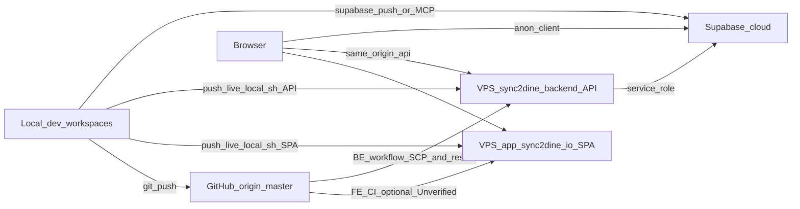

# Sync2Dine — Application Master (navigation)

**Primary product:** Sync2Dine (AI phone + restaurant ordering / Atmosphere).  
**Live app + API:** **https://app.sync2dine.io**  
**Repos:** `sync2dine-frontend` + `sync2dine-backend` (`origin/master`).  
**Last orientation update:** 2026-07-23.

This file is a **map**, not a second copy of every technical doc. Prefer linked SoT files for deep detail.

Historical Builder Diddies / tradepro ops live in [`archive/BUILDER_DIDDIES_OPS.md`](./archive/BUILDER_DIDDIES_OPS.md) — **do not deploy, verify, or edit against that file**.

---

## Start here (agents)

| Need | Open |
|------|------|
| FE layout / traps | [`AGENTS.md`](../AGENTS.md) |
| Architecture (short) | [`ARCHITECTURE.md`](./ARCHITECTURE.md) |
| Capability inventory | [`CAPABILITY_INVENTORY.md`](./CAPABILITY_INVENTORY.md) |
| BE mounts / domains | [`../sync2dine-backend/AGENTS.md`](../../sync2dine-backend/AGENTS.md), [`server/README.md`](../../sync2dine-backend/server/README.md) |
| Phone personalities (Judie / Sally sales / Sally staff) | [`../sync2dine-backend/docs/PHONE_ARCHITECTURE.md`](../../sync2dine-backend/docs/PHONE_ARCHITECTURE.md) |
| Sally shared BI + channel adapters | [`../sync2dine-backend/docs/SALLY_ARCHITECTURE.md`](../../sync2dine-backend/docs/SALLY_ARCHITECTURE.md) |
| Legacy name map | [`../sync2dine-backend/docs/LEGACY_ALIASES.md`](../../sync2dine-backend/docs/LEGACY_ALIASES.md) |
| Post-restructure audit | [`POST_RESTRUCTURE_AUDIT.md`](./POST_RESTRUCTURE_AUDIT.md) |
| **Engineering audit (2026-07-23)** | [`ENGINEERING_AUDIT_REPORT.md`](./ENGINEERING_AUDIT_REPORT.md) · diagrams [`ARCHITECTURE_DIAGRAMS.md`](./ARCHITECTURE_DIAGRAMS.md) |
| Agent harness scores | [`AGENT_HARNESS_AUDIT.md`](./AGENT_HARNESS_AUDIT.md) |
| Deploy SoT | `bash scripts/push-live-local.sh` (SPA from FE; API from sibling backend on VPS port **3011**) |
| Tests / map check | BE: `npm test` · FE: `npm run build` · `npm run check:agent-maps` |
| Known legacy | FE `server-legacy/` **not in git / do not restore**; BE `server/_quarantine/` |

### Live brand / host (Sync2Dine)

| Item | Value |
|------|--------|
| Display name | **Sync2Dine** |
| Marketing | **https://sync2dine.io** |
| App / API | **https://app.sync2dine.io** |
| Frontend remote | `https://github.com/dolab-jpg/sync2dine-frontend.git` |
| Backend remote | `https://github.com/dolab-jpg/sync2dine-backend.git` |
| VPS API port | **3011** (local Node default may be `3001` — do not confuse with live) |

Detail diagrams: [`ARCHITECTURE_DIAGRAMS.md`](./ARCHITECTURE_DIAGRAMS.md) · BE [`ARCHITECTURE_DIAGRAMS.md`](../../sync2dine-backend/docs/ARCHITECTURE_DIAGRAMS.md).

**Rules for AI and product copy**

1. Sync2Dine is the live product. Do not verify or deploy to `app.b-diddies.com` unless the user explicitly asks for Builder Diddies.
2. Sally sells Sync2Dine (Judie / Atmosphere / Complete). Judie takes diner orders. Staff **web** AI is Cynthia — not Sally Web. A separate Cynthia **phone** brain still exists when DID purpose/persona is `cynthia` (construction); see [`PHONE_ARCHITECTURE.md`](../../sync2dine-backend/docs/PHONE_ARCHITECTURE.md).
3. Names like `tradepro-*` / Builder Diddies may appear in archived docs or old symbols — **legacy only**. See [`LEGACY_ALIASES.md`](../../sync2dine-backend/docs/LEGACY_ALIASES.md).

---

## How to use this document

1. Use the Start-here table for orientation.
2. **§§23–25** = coverage matrix + Feature Location Atlas + API catalogue (update when adding features).
3. Deep ops archaeology → [`archive/BUILDER_DIDDIES_OPS.md`](./archive/BUILDER_DIDDIES_OPS.md) only.
4. When you add a feature: update §23 matrix, §24 atlas row, §25 API line, and [`CAPABILITY_INVENTORY.md`](./CAPABILITY_INVENTORY.md) in the same session. Run `npm run check:agent-maps`.

### Status markers

| Marker | Meaning |
|--------|---------|
| `LIVE` | Present in code and verified on the expected runtime (or clearly production-wired) |
| `PARTIAL` | Exists but incomplete, mock-backed, or feature-flag / role-gated |
| `LEGACY` | Code exists but is not the source of truth |
| `GITHUB_ONLY` | On `origin/master` (or local+GH) but **not** on VPS and/or not on Supabase |
| `VPS_ONLY` | Present on VPS but missing from local/`origin/master` (rare drift) |
| `SUPABASE_ONLY` | Present in cloud schema but missing from local migrations (rare drift) |
| `PLANNED` | Registry stub / “future” wording only |
| `DO_NOT_SHIP` | Local scratch, session data, secrets, Playwright artifacts |

---

# Part C — Coverage, locations, API catalogue

Cross-checked against `routeMap.ts`, `routes.tsx`, and `sync2dine-backend/server/index.ts` (2026-07-23).

---

## 23. Done vs not done (coverage matrix)

Legend: **DONE** = detailed in this MD · **THIN** = mentioned only · **MISSING** = surface in code but not documented · **ORPHAN** = code exists, no route.

### 23.0 Sync2Dine restaurant + phone (primary product)

| Feature | Code exists | Doc coverage | Primary § / doc |
|---------|-------------|--------------|-----------------|
| Restaurant live board | YES | DONE | §24.J |
| Kitchen / till / delivery boards | YES | DONE | §24.J, `MEAL_DEALS.md` |
| Menu + meal deals | YES | DONE | §24.J, `MEAL_DEALS.md` |
| Bookings board | YES | DONE | §24.J |
| Front kiosk | YES | DONE | §24.J |
| Judie landing / diner phone | YES | DONE | §24.J, PHONE_ARCHITECTURE |
| Atmosphere / pricing / start checkout | YES | THIN | §24.J, CAPABILITY_INVENTORY |
| Sally offer / knowledge / Sales Brain UI | YES | DONE | §24.J |
| Sally Web marketing chat | YES | DONE | SALLY_ARCHITECTURE, CAPABILITY_INVENTORY |
| Sally sales + staff PIN phone | YES | DONE | PHONE_ARCHITECTURE |
| Orders / menu / reservations API | YES | DONE | §25.1 |
| Connectors / POS forward | YES | THIN | §25.1 |

### 23.1 Construction / platform surfaces (still shipped)

| Feature | Code exists | Doc coverage | Primary § |
|---------|-------------|--------------|-----------|
| Auth login/signup/invite/password/profile | YES | DONE | §24.A |
| AppShell role nav + org picker | YES | DONE | §24.A |
| Staff AI overlay (Cynthia) | YES | DONE | §24.A, §24.F |
| Self-heal / code-fix | YES | DONE | §24.A |
| CRM / customers / leads | YES | DONE | §24.C |
| Quotes / estimating | YES | DONE | §24.B |
| Projects / builder / portal | YES | DONE | §24.D |
| Communications / mailbox / WhatsApp Web | YES | DONE | §24.E |
| Call Centre UI (softphone + lines) | YES | DONE | §24.F — phone **AI** is Judie/Sally, not Cynthia |
| Contracts / planning / BC | YES | DONE | §24.G |
| Costing / accounts / recruitment / team / platform | YES | DONE | §24.H |
| Designer / survey / booking / products / settings | YES | DONE | §24.I |

### 23.2 Backend / API surfaces

| Surface | Doc coverage |
|---------|--------------|
| Mount order + domain folders | BE `server/README.md` + §25 |
| Orders / menu / reservations / connectors | DONE §25.1 |
| Sally web / knowledge / sales-brain | DONE §25.1 |
| `ai-proxy` sub-handlers | DONE §25.2 |
| JSON under `server/data/` = **cache only** | DONE §25.4 |
| FE `server-legacy/` | LEGACY — not in git; never edit |

### 23.3 Keep this current

Update §23/§24/§25 + `CAPABILITY_INVENTORY.md` when shipping. Re-probe live (`https://app.sync2dine.io/health`) after prod ship.

---

## 24. Feature Location Atlas

**Path roots**

| Root | Meaning |
|------|---------|
| `FE` | `sync2dine-frontend/` |
| `FE/src` | `FE/src/app/` unless noted |
| `BE` | `sync2dine-backend/` |
| `BE/server` | Canonical production API (VPS Node on **:3011**, unit under sync2dine-backend) |
| Root `BE/server/*.ts` re-exports | **Stubs** — edit domain path (`phone/`, `orders/`, `ai/`, …) |
| `BE/server/_quarantine/` | Do not edit for product work |
| FE `server-legacy/` | **Absent from git** — never restore for product edits |

Each feature row: **UI → Components → Engine → API file(s) → Data**.  
Data column: Supabase is primary unless marked cache/fallback.

### 24.A Auth & shell

| Feature | UI | Components | Engine | API (BE/server) | Data |
|---------|-----|------------|--------|-----------------|------|
| Login | `/login` | `auth/pages/LoginPage.tsx`, `auth/components/SeedAccountsPanel.tsx` | `auth/lib/authApi.ts`, `engine/auth/sessionStore.ts` | `auth.ts`, `account-auth.ts` → `/api/auth/login`, `/me`, `/resolve-username` | Supabase `auth.users` + `profiles` |
| Signup | `/signup` | `SignupPage.tsx`, `SignupModeTabs.tsx` | `authApi.ts`, `platform/platformApi.ts` | `account-auth.ts` → `register-org`, … | `organizations`, `profiles` |
| Invite accept | `/invite/:token` | `InviteAcceptPage.tsx` | `authApi.ts` | `account-auth.ts` → `/api/auth/invites*`, `accept-invite` | `org_invites` |
| Forgot / reset password | `/forgot-password`, `/reset-password` | auth pages | `authApi.ts` | Supabase Auth direct | — |
| Profile / password | `/profile`, `/profile/password` | `ProfilePage`, `ChangePasswordPage` | session + authApi | Supabase profile update | `profiles` |
| Role redirect | post-login | `auth/lib/redirectByRole.ts` | — | — | — |
| App shell / nav | `*` authed | `AppShell.tsx` | i18n `shell` | — | localStorage nav expand (UX only) |
| Org picker | header | `platform/OrgActingAsPicker.tsx` | `orgContext.ts`, `homeOrg.ts`, `platformApi.ts` | `/api/platform/*` | `organizations` |
| Notifications | shell bell + `/notifications` | `NotificationSystem.tsx`, `NotificationsPage.tsx` | `notifications/notificationStore.ts`, `notify.ts`, `resolveNotificationRoute.ts` | lead inbox poll `/api/leads/inbox` | local + lead inbox |
| Online banner | shell | `OnlineStatusBanner.tsx` | — | — | — |
| AI overlay | docked | `AI/AIAssistantOverlay.tsx`, `AIChatPanel.tsx` | `aiChatService.ts`, `staffAiService.ts`, `AIAssistantContext` | `/api/ai/staff`, `/orchestrate`, `/api/cynthia/*` | conversation stores |
| Activity panel | shell | `AI/CynthiaActivityPanel.tsx` | `ai/agentActivity.ts` | `/api/agent-activity` | `agent_activity_events` |
| Self-heal bridge | global | `AI/SelfHealErrorBridge.tsx` | `selfHealEvents.ts`, `codeFixService.ts` | `/api/ai/code-fix*` | Supabase `code_fix_jobs` (JSON = cache) |
| Cursor paste | `/cursor-paste` | `pages/CursorPastePage.tsx` | — | `/api/agent/credentials/*` (dev) | `.cursor/local/deploy.env` |

### 24.B Quotes, estimating, approvals

| Feature | UI | Components | Engine | API | Data |
|---------|-----|------------|--------|-----|------|
| Quotes list | `/quotes` | `QuotesList.tsx` | quotes context, `salesCloseFlow.ts` | sync `/api/data/sync` | Supabase + synced-data cache |
| Quote wizard | `/quote/...`, `/ai-estimate/...` | `QuoteBuilder/*` | `quoteCalculator.ts`, `aiEstimationService.ts`, `config/trades/*` | `/api/ai/estimate`, `/api/ai/orchestrate` | trades JSON configs |
| Quote lines | `/quote-lines/...` | `QuoteLineBuilder.tsx`, `QuoteLineEditor.tsx` | `quotes/quoteLineUtils.ts`, `messaging/pdfGenerator.ts` | — | quotes |
| Job pricing | `/price-job` | `JobPricing/JobPricing.tsx` | `pricing/smallJobsService.ts`, … | `/api/ai/price-research`, `/api/ai/estimate` | — |
| Approvals | `/approvals` | `Approvals/ApprovalsQueue.tsx` | quote approval gates in App | — | quotes |
| Sales close / contract gate | from quotes | — | `salesCloseFlow.ts` | contracts APIs | quotes → contracts |
| Trades | drives wizard | — | `config/trades/*` + playbooks | — | files |

### 24.C CRM & customers

| Feature | UI | Components | Engine | API | Data |
|---------|-----|------------|--------|-----|------|
| CRM | `/crm` | `ComprehensiveCRM.tsx` + `leads/leadActivity.ts` | `leads/leadService.ts` | `/api/leads/*` | customers + activities (Supabase / sync cache) |
| Customers | `/customers` | `CustomerManagement.tsx`, `CustomerContactsPanel.tsx` | `contacts/contactStore.ts`, leads | `/api/auth/customers`, data sync | `customers`, `contacts` |
| Lead inbox | `/communications?tab=leads` | `mailbox/LeadInboxPanel.tsx` | `leads/leadInboxService.ts` | `/api/leads/inbox*` | lead inbox + Supabase |
| Sales mgmt | `/sales` | `SalesManagement.tsx` | — | — | quotes/customers |

### 24.D Projects, builder, change orders, portal

| Feature | UI | Components | Engine | API | Data |
|---------|-----|------------|--------|-----|------|
| Projects | `/projects`, `/projects/:id`, `/builder-projects…` | `BuilderProjectManagement.tsx` + `project/*` tabs | `project/projectStore.ts`, … | `/api/data/sync`, `/api/files/upload`, `/api/portal/:token` | `projects`, `project_files` |
| Project AI | `?tab=ai` | `project/ProjectAIPanel.tsx` | `projectAi/*` | `/api/ai/project` | — |
| Builder dashboard | `/builder` | `BuilderDashboard.tsx` | project store | — | projects |
| Builder management | `/builder-management` | `BuilderManagement.tsx` | `builder/builderStore.ts` | — | `builders` |
| Change orders | `/changes` | `ChangeOrders.tsx` | project types | portal/contracts paths | project data |
| Customer portal | `/portal/:token` | `CustomerPortal.tsx` | `cyrus/*` | `/api/portal/:token`, `/api/cyrus/portal*` | projects |
| PM scheduler | background | — | `ai/pmScheduler.ts` | — | — |

### 24.E Communications

| Feature | UI | Components | Engine | API | Data |
|---------|-----|------------|--------|-----|------|
| Comms hub | `/communications`, `/email` | `CommunicationsHub.tsx` | `messaging/messagingHub.ts`, … | `/api/messages/send`, mailbox, WA | message logs |
| Lead inbox tab | `?tab=leads` | `LeadInboxPanel` | leadInboxService | `/api/leads/inbox*` | lead inbox |
| Mailbox | Comms + Settings | `InboxPanel`, `EmailComposePanel`, `MailboxConnectPanel` | `mailbox/mailboxService.ts` | `/api/mailbox/*` | mailbox tables + JSON cache |
| WhatsApp QR | `/integrations` | `WhatsAppWebPanel.tsx` | — | `/api/whatsapp-web/*` | `.wwebjs_auth/` (DO_NOT_SHIP) |
| Meta WA (cold) | `/webhooks/whatsapp` inert | — | — | `whatsapp-webhook.ts` gated | — |

### 24.F AI agents (web + call UI)

| Feature | UI | Components | Engine | API | Notes |
|---------|-----|------------|--------|-----|-------|
| Cynthia (staff web) | `/cynthia` | `Cynthia/*`, `AI/*` | `cynthia/*`, `ai/toolRuntime*` | `ai/cynthia-routes.ts`, `ai-proxy` → staff/orchestrate | **Not** a phone brain |
| Cynthia website widget | external embed | `public/cynthia-widget.js` (+ `cyrus-widget.js` alias) | `engine/cyrus/*` | `ai/cyrus-routes.ts`, `/api/ai/cyrus` | Legacy Cyrus name |
| Call Centre (lines UI) | `/calls` | `CallCenter/*` | — | `phone/vapi-routes`, `phone/phone-webhook`, `ai/agent-routes` | Phone AI = **Judie / Sally** |
| Softphone | `/calls?tab=softphone` | `SoftPhonePanel.tsx` | jssip | SIP WSS (PARTIAL) | Human softphone |
| Staff phones | Settings → Team | `StaffSoftphones`, `StaffPhoneRegistration` | — | `/api/agent/lines*`, `/api/org/staff/*` | |
| AI Studio | Settings → AI | `aiStudio/AIStudioPanel.tsx` | `aiStudioStore.ts` | `/api/ai/studio`, language-packs, conversation-log, code-fix | |
| AI Audit | `/ai-audit` | `ConversationAudit`, `CodeFixesAudit` | conversationLogService, codeFixService | conversation-log + code-fix | |

Phone personality SoT: [`PHONE_ARCHITECTURE.md`](../../sync2dine-backend/docs/PHONE_ARCHITECTURE.md).

### 24.G Contracts, planning, building control

| Feature | UI | Components | Engine | API | Data |
|---------|-----|------------|--------|-----|------|
| Contracts hub | `/contracts` | `Contracts/ContractsHub.tsx` | `contracts/*` | `contract-routes.ts` | `contracts` |
| Public sign | `/contract/:token` | `ContractSignPage.tsx` | contractSignEffects | `/api/contract/:token`, `/sign` | contracts |
| Planning | `/planning`, `/planning/:id` | `planning/*` | `planning/*` | `/api/ai/planning` | `planning_applications` |
| Building control | `/building-control` | `buildingControl/*` | `buildingControl/*` | `building-control-routes.ts`, `/api/ai/building-control` | BC registry |

### 24.H Money, recruitment, team, platform

| Feature | UI | Components | Engine | API | Data |
|---------|-----|------------|--------|-----|------|
| Costing | `/costing` | `CostingDashboard.tsx` | `costing/*` | — | synced costing |
| Accounts (construction) | `/accounts` | `accounts/AccountsHub.tsx` | `banking/*` | `banking-routes.ts` | bank_* |
| Finance app | `/finance` | `FinanceApplication.tsx` | Stripe | `billing/stripe-routes.ts` | org subscription |
| Recruitment | `/recruitment` | `RecruitmentCRM.tsx` | `recruitment/recruitmentStore.ts` | phone recruitment tools | recruitment_* |
| Team | `/team` | `TeamManagement.tsx` | invites | `account-auth` members/invites | profiles |
| Platform clients | `/platform/clients` | `PlatformClientsCRM.tsx` | `platformApi.ts` | `platform-routes.ts` | organizations |
| Portfolio | `/portfolio` | `Portfolio.tsx` | completion → portfolio | — | portfolio |

### 24.I Design, survey, booking, products, settings misc

| Feature | UI | Components | Engine | API | Data |
|---------|-----|------------|--------|-----|------|
| Designer | `/designer` | `BathroomDesigner.tsx` | trades | — | — |
| AI render | `/ai-render/:tradeId?` | `AIBathroomRender.tsx` | `ai/renderService.ts` | `/api/ai/render` | — |
| Site survey | `/site-survey` | `SiteSurvey.tsx` | `surveyScorer.ts` | — | — |
| Booking (construction) | `/booking` | `BookingSystem.tsx` | google_calendar | — | — |
| Products | `/products` | `ProductCatalog.tsx` | `data/tradeProducts` | — | `products` |
| Import/export | Settings → Import/Export | `settings/ImportExportPanel.tsx` | `data/dataImportExportService.ts` | `/api/data/sync` | packs |
| Settings | `/settings` | `Settings.tsx` | pricingRules / stages | — | local + company profile |
| Cloud persist | all CRUD | App context | `data/supabaseStore.ts`, `cloudPersist.ts` | Supabase REST + `/api/data/sync` | Supabase primary; JSON cache |
| Native push | bridge | `bridge/nativeBridge.ts` | — | `/api/push/*` | `device_tokens` |

### 24.J Restaurant / Atmosphere / Judie / Sally UI

| Feature | UI | Components | Engine / notes | API (BE) | Data / SoT |
|---------|-----|------------|----------------|----------|------------|
| Live board | `/` (restaurant) | `restaurant/RestaurantLive.tsx` | experience gate | `/api/orders*` | Supabase orders |
| Kitchen board | `/orders/kitchen` | `RestaurantOrders.tsx` | board mode kitchen | `/api/orders` | Supabase orders |
| Till | `/orders/till` | `restaurant/RestaurantTill.tsx` | — | `/api/orders`, `/api/menu` | orders + menu |
| Delivery board | `/orders/delivery` | `RestaurantOrders.tsx` | board mode delivery | `/api/orders` | Supabase orders |
| Menu manager | `/menu` | `restaurant/MenuManager.tsx` | meal deals — see `MEAL_DEALS.md` | `/api/menu` | Supabase menu |
| Bookings | `/bookings` | `restaurant/BookingsBoard.tsx` | — | `/api/reservations`, `/api/dining-tables` | Supabase |
| Restaurant accounts | `/accounts` (restaurant) | `restaurant/RestaurantAccounts.tsx` | — | billing / org APIs | org |
| Restaurant settings | `/settings` (restaurant) | `restaurant/RestaurantSettings.tsx` | — | org integrations | org |
| Front kiosk | `/front` | `FrontKiosk.tsx` | public diner | orders/menu as wired | — |
| Judie marketing | `/judie` | `JudieLandingPage.tsx` | — | — | — |
| Atmosphere | `/atmosphere` | `AtmosphereLandingPage.tsx` | — | — | — |
| Pricing / start | `/pricing`, `/start` | `PricingPage.tsx`, `StartCheckoutFlow.tsx` | — | Stripe / billing | — |
| Public integrations | `/integrations` (public) | `restaurant/IntegrationsPublicPage.tsx` | — | — | — |
| Sally offer (platform) | `/platform/sally-offer` | `platform/SallyOfferSettings.tsx` | offer facts → BE `sally/offer.ts` | platform / sally | offer config |
| Sally knowledge | `/platform/sally-knowledge` | `platform/SallyKnowledgePanel.tsx` | — | `/api/sally-knowledge` | Supabase KB |
| Sales Brain | `/platform/sales-brain` | `platform/SalesBrainPanel.tsx` | — | `/api/sales-brain` | Supabase |
| Client menu preview | `/platform/clients/:orgId/menu` | `platform/MenuPreview.tsx` | — | `/api/menu` | menu |
| Judie phone (diner) | Vapi DID `aria` | — | `brains/judie`, `phone/*` | `phone/vapi-routes.ts` | orders org-scoped |
| Sally sales phone | Vapi DID `sally` | — | `brains/sally`, `phone/sally-sales-phone.ts`, `sally/*` | `phone/vapi-routes.ts` | platform org |
| Sally staff PIN | same Sally DID | — | Sally brain staff mode | phone tools | CRM/mailbox |
| Sally Web chat | marketing widget | — | `sally/web-chat.ts` | `POST /api/sally/web` | shared Sally BI |

Route catalogue SoT for paths: [`src/app/routeMap.ts`](../src/app/routeMap.ts). Experience split: `engine/platform/experience.ts`.

---

## 25. API location catalogue (where each API is stored)

Canonical: **`BE/server/`**. Entry: [`index.ts`](../../sync2dine-backend/server/index.ts). Prefer **domain folder** paths; root filenames are often re-export stubs.

### 25.1 Route / webhook files → path families

| Canonical module | Root stub (if any) | Paths / family |
|------------------|--------------------|----------------|
| `whatsapp-webhook.ts` | — | `/webhooks/whatsapp`, `/api/messages/send`, `/health` |
| `phone/phone-webhook.ts` | `phone-webhook.ts` | `/webhooks/voice/*`, `/api/calls`, `/api/calls/outbound` |
| `phone/vapi-routes.ts` | `vapi-routes.ts` | `/webhooks/vapi`, `/api/vapi/*` |
| `ai/agent-routes.ts` | `agent-routes.ts` | `/api/agent/*`, contacts lookup |
| `project-routes.ts` | — | `/api/data/sync`, `/api/files/upload`, `/api/portal/:token`, project checkout |
| `building-control-routes.ts` | — | `/api/building-control/*` |
| `ai/ai-studio-routes.ts` | `ai-studio-routes.ts` | `/api/ai/studio` |
| `sales-brain/routes.ts` | — | `/api/sales-brain` |
| `sally-product-kb/routes.ts` | — | `/api/sally-knowledge` |
| `ai/conversation-audit.ts` | `conversation-audit.ts` | `/api/ai/conversation-log*` |
| `banking-routes.ts` | — | `/api/banking/*` |
| `mailbox-routes.ts` | — | `/api/mailbox/*`, `/webhooks/gmail\|outlook` |
| `calendar-routes.ts` | — | `/api/calendar/*` |
| `mailbox/package-updates.ts` | — | `/api/integrations/package-updates` |
| `messages-routes.ts` | — | `/api/messages/*` |
| `price-research-routes.ts` | — | `/api/ai/price-research` |
| `contract-routes.ts` | — | `/api/contracts`, `/api/contract/:token` |
| `billing/stripe-routes.ts` | `stripe-routes.ts` | `/api/stripe/*` |
| `auth.ts` + `account-auth.ts` | — | `/api/auth/*` |
| `org-openai-key-routes.ts` | — | `/api/org/openai-key`, `/api/org/ai-brain` |
| `org-integrations-routes.ts` | — | `/api/org/.../integrations` |
| `billing/org-phone-billing-routes.ts` | `org-phone-billing-routes.ts` | org phone billing |
| `billing/weekly-billing-routes.ts` | `weekly-billing-routes.ts` | `/api/billing/weekly` |
| `platform-routes.ts` | — | `/api/platform/*` |
| `leads-routes.ts` | — | `/api/leads/*` |
| `orders/orders-routes.ts` | `orders-routes.ts` | `/api/orders` |
| `orders/menu-routes.ts` | `menu-routes.ts` | `/api/menu` |
| `orders/reservations-routes.ts` | `reservations-routes.ts` | `/api/reservations`, `/api/dining-tables` |
| `connectors/routes.ts` | — | `/api/connectors` |
| `ai/cyrus-routes.ts` | `cyrus-routes.ts` | `/api/cyrus/*` |
| `ai/cynthia-routes.ts` | `cynthia-routes.ts` | `/api/cynthia/*` |
| `sally-web-routes.ts` → `sally/web-chat.ts` | — | `POST /api/sally/web` |
| `channel-routes.ts` | — | `/api/language-packs`, `/api/translate/*`, `/api/org/staff/*`, `/api/customer/pin/verify`, `/api/concierge/outbound` |
| `agent-credentials-routes.ts` | — | `/api/agent/credentials/*` |
| `push-routes.ts` | — | `/api/push/*` |
| `whatsapp-web-routes.ts` | — | `/api/whatsapp-web/*` |
| `ai/gap-api-routes.ts` | `gap-api-routes.ts` | gap SMS/Stripe/banking helpers |
| `agent-activity-routes.ts` | — | `/api/agent-activity` |
| `ai/ai-proxy.ts` (catch) | `ai-proxy.ts` | `/api/ai/*` remaining |

### 25.2 `ai-proxy` → handler modules (under `ai/` unless noted)

| Path | Handler |
|------|---------|
| `/api/ai/health` | `openai-health.ts` |
| `/api/ai/code-fix*` | `code-fix-handler.ts` |
| `/api/ai/transcribe` | `orchestrate-stream.ts` |
| `/api/ai/cyrus` | `cyrus-handler.ts` |
| `/api/ai/project` | `project-ai-handler.ts` |
| `/api/ai/orchestrate` | `orchestrator-handler.ts` |
| `/api/ai/orchestrate/stream` | `orchestrate-stream.ts` |
| `/api/ai/staff` | `staff-ai-handler.ts` |
| `/api/ai/building-control` | `building-control-handler.ts` |
| `/api/ai/planning` | `planning-ai-handler.ts` |
| `/api/ai/summarize` | `summarize-handler.ts` |
| `/api/ai/categorize-transaction` | `categorize-transaction-handler.ts` |
| `/api/ai/receipt` | `receipt-handler.ts` |
| `/api/ai/estimate` | estimate / vision |
| `/api/ai/tts` | `tts.ts` |
| `/api/ai/render` | `render-handler.ts` |

### 25.3 Edge functions

| Surface | Path |
|---------|------|
| Edge `platform-orgs` | `BE/supabase/functions/platform-orgs/` |
| Edge `stripe-webhook` | `BE/supabase/functions/stripe-webhook/` |
| Edge `contract-portal` | `BE/supabase/functions/contract-portal/` |

`BE/sip-bridge/` is **unsupported** for phone AI — Vapi only. See PHONE_ARCHITECTURE.

### 25.4 Backend JSON under `BE/server/data/` (cache / offline fallback)

**Not production SoT.** Supabase cloud is primary. Local JSON may hydrate or write-through for CRM/calls/lines and similar — fixing live bugs by editing these files alone is wrong.

| File | Feature backing (cache) |
|------|-------------------------|
| `synced-data.json` / `synced-data-{orgId}.json` | CRM/projects/quotes/calls via `data-store.ts` |
| `organizations.json` | Org registry cache |
| `usage-events.json` | Usage metering cache |
| `mailbox-data.json` | Mailbox OAuth + cache |
| `code-fix-jobs.json` | Self-heal queue cache — live SoT = Supabase `code_fix_jobs` |
| `ai-studio.json` | AI Studio cache |
| `.wwebjs_auth/` | WhatsApp Web session — **DO_NOT_SHIP** |

---

*Living map. Historical ops → [`archive/BUILDER_DIDDIES_OPS.md`](./archive/BUILDER_DIDDIES_OPS.md). Keep §§23–25 + CAPABILITY_INVENTORY updated when adding features.*
