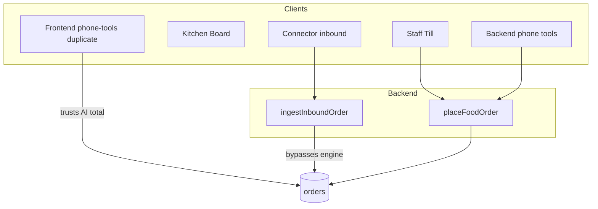

# Sync2Dine App-Level Ordering — Gap-Finding and Missing-Capability Review

**Date:** 2026-07-22  
**Scope:** Application ordering platform (staff Till, kitchen board, menu, connectors, `placeFoodOrder`). Phone agent treated only as one client.  
**Repos:** `sync2dine-frontend`, `sync2dine-backend`  
**Live host probed:** `https://app.sync2dine.io`  
**Method:** Code trace + live HTTP probes + `npm test` (backend). No remediations in this pass.

---

## 1. Executive summary

Sync2Dine has a real shared order engine — backend `placeFoodOrder` in `server/order-service.ts` — used by staff `POST /api/orders` and backend phone tools. Staff can create and cancel orders, manage Square mapping/retry, and enforce catalog pricing on the canonical path.

However, **production currently exposes unauthenticated order list/create/patch APIs**, marketplace inbound bypasses the engine, a **frontend duplicate place-order path still trusts AI totals**, food payments are status flags only, and core restaurant economics (min order, delivery fee, tax, opening hours, amend, suspend) are missing or prompt-only.

**Overall Gap Verdict: Critical gaps preventing production use** — driven primarily by live-reproduced order API exposure and price-integrity drift in the frontend server duplicate. Even if auth were fixed tomorrow, important structural gaps remain that require targeted work before multi-channel / multi-branch / marketplace readiness.

---

## 2. Architecture context (supporting)

| Intended | Implemented |
|----------|-------------|
| Modular monolith, API-first order engine | Yes for staff API + backend phone |
| All channels share validation/pricing | Partial — inbound + frontend duplicate diverge |
| Org multi-tenant | Yes (`org_id` / RLS); **no branches** |
| Adapter-based connectors | Folder exists; Square live; hubs/EPOS stubs |

---

## 3. Already completed (not open gaps)

| Capability | Evidence |
|------------|----------|
| Shared `placeFoodOrder` (backend phone + staff API) | `sync2dine-backend/server/phone-tools.ts` ~1463 imports `order-service`; `orders-routes.ts:57` |
| Catalog price wins (canonical engine) | `order-service.ts:208`, `:290–291` |
| Staff Till create | `RestaurantTill.tsx` → `POST /api/orders` |
| Staff cancel | `RestaurantOrders.tsx` → `status: 'cancelled'` |
| Square connect / map / test / retry | `SquareConnectPanel.tsx`, `OrderPosSyncBadge.tsx` |
| Connector inbound idempotency | `connectors/routes.ts:81–98`, `event-log.ts` |
| Connector event log UI | `ConnectedSystemsPanel.tsx` |
| Pay-at-door cash/card method normalisation | `order-service.ts:353–362` |

---

## 4. Live probes and tests

| Probe | Result | Evidence |
|-------|--------|----------|
| `GET https://app.sync2dine.io/health` | 200 `{"status":"ok"}` | Live 2026-07-22 |
| `GET https://app.sync2dine.io/api/orders` **no auth** | **200**, returned 4 orders including `customerPhone` for home org `4fc49703-…` | **Reproduced** — GAP-SEC-001 |
| `POST https://app.sync2dine.io/api/orders` `{"items":[]}` **no auth** | 400 `items_required` from `placeFoodOrder` | **Reproduced** — unauthenticated request reaches engine |
| Backend `npm test` | **55 pass / 0 fail** | Full install; suite **does not include** `order-service.test.ts` / `placeFoodOrder` |
| `order-service.test.ts` | Vitest file exists; only `resolvePosPushMode`; **not in npm test script** | GAP-TEST-001 |

---

## 5. Master gap register

### GAP-SEC-001 — Unauthenticated `/api/orders` (GET/POST/PATCH)

| Field | Value |
|-------|-------|
| **Severity** | Critical |
| **Type** | Security gap |
| **Affected area** | Orders API, tenant data, kitchen board mutations |
| **Current** | `handleOrdersRoutes` never calls `requireAuth` / `isAuthEnforced`. Org resolved via header or `DEFAULT_ORG_ID`. Live GET returns orders with customer phones. Unauthenticated POST reaches `placeFoodOrder`. PATCH accepts arbitrary body. |
| **Expected** | JWT required for all staff order verbs when production auth is on; deny anonymous list/create/mutate. |
| **Evidence** | `sync2dine-backend/server/orders-routes.ts:32–130` (esp. L39, L42–46, L48–107, L110–129). Live: `GET /api/orders` → 200 with PII. Contrast: `connectors/routes.ts:167` uses `isAuthEnforced && !requireAuth`. |
| **Reproduced** | Yes (live) |
| **Business impact** | Order data exposure; forged orders; status/payment tampering |
| **Customer impact** | Phone numbers and order details exposed |
| **Operational impact** | Staff cannot trust board integrity |
| **Security / financial risk** | High — unauthorised read/write of orders |
| **Recommended correction** | Add `requireAuth` to GET/POST/PATCH; never fall back to home org for anonymous; rate-limit; audit actor |
| **Required tests** | Unauthenticated 401; wrong-org denied; authenticated happy path |
| **Priority** | P0 |
| **Dependencies** | None |
| **Complexity** | S |

---

### GAP-PRICE-001 — Frontend duplicate `placeFoodOrder` trusts AI total

| Field | Value |
|-------|-------|
| **Severity** | Critical |
| **Type** | Phone-agent dependency / Incomplete implementation |
| **Affected area** | Pricing integrity if frontend server path is used |
| **Current** | Frontend `server/phone-tools.ts` reimplements place order; `totalBeforeSpecial` uses `input.total` when positive. Backend canonical engine always uses catalog `pricedTotal`. |
| **Expected** | Single engine; never trust client/AI money fields. |
| **Evidence** | `sync2dine-frontend/server/phone-tools.ts:1664–1666` vs `sync2dine-backend/server/order-service.ts:290–291`. No `order-service.ts` in frontend repo. |
| **Reproduced** | Code-only (logic path clear); live path depends which server answers phone tools |
| **Business / financial risk** | Undercharged orders |
| **Recommended correction** | Delete frontend duplicate; always import shared `order-service` (or call backend API only) |
| **Required tests** | AI-supplied `total: 0.01` rejected; catalog total used |
| **Priority** | P0 |
| **Complexity** | M |

---

### GAP-INT-001 — Connector inbound bypasses `placeFoodOrder`

| Field | Value |
|-------|-------|
| **Severity** | High |
| **Type** | Integration gap / Business-logic gap |
| **Affected area** | Marketplace / Deliverect / custom inbound |
| **Current** | After HMAC + idempotency, `ingestInboundOrder` → `saveOrderRecord` with partner totals/items. Skips catalog, allergy, delivery-area, fee/min rules. |
| **Expected** | Normalise through shared validation (or explicit “trusted partner” policy with audit). |
| **Evidence** | `connectors/routes.ts:69–138` (`saveOrderRecord` L123); `inbound-orders.ts` `inboundOrderToSavePayload` |
| **Reproduced** | Code-only (needs connector secret) |
| **Impact** | Incorrect kitchen tickets; inconsistent rules vs phone/till |
| **Recommended correction** | Shared `normaliseInboundOrder` → catalog map + optional soft/hard gates; log partner total vs catalog total |
| **Required tests** | Unknown item handling; duplicate externalId; allergy fields |
| **Priority** | P1 |
| **Complexity** | L |

---

### GAP-SEC-002 — PATCH orders accepts arbitrary fields without revalidation

| Field | Value |
|-------|-------|
| **Severity** | High (Critical when combined with GAP-SEC-001) |
| **Type** | Security gap / Business-logic gap |
| **Affected area** | Order amend, payment, totals |
| **Current** | `updateOrderRecord(id, body)` merges any JSON fields including `items`, `total`, `paymentStatus`. No status machine, no actor, no ETag. |
| **Expected** | Allowlisted fields; status transitions; line amendments via engine recalculation. |
| **Evidence** | `orders-routes.ts:110–129`; `data-store.ts` `updateOrderRecord` merge |
| **Reproduced** | Code-only |
| **Recommended correction** | Split status/payment patch from amend-items API; validate transitions |
| **Priority** | P0/P1 |
| **Complexity** | M |

---

### GAP-PAY-001 — Food payments are flags only; no capture/refund/reconcile

| Field | Value |
|-------|-------|
| **Severity** | High |
| **Type** | Missing feature / Incomplete implementation |
| **Affected area** | Payments, Accounts, refunds |
| **Current** | `paymentStatus` / `paymentMethod` cash|card|paid|unpaid. Stripe refund in `gap-api-routes.ts` is SaaS/quote path, not food. Accounts UI aggregates flags only. |
| **Expected** | Explicit pay-at-door vs online capture model; authorised refund flow with audit. |
| **Evidence** | `order-service.ts:343–362`; `RestaurantAccounts.tsx`; `gap-api-routes.ts` Stripe refund |
| **Reproduced** | Code-only |
| **Financial risk** | False “paid”; no refund control; no reconciliation |
| **Priority** | P1 |
| **Complexity** | L |

---

### GAP-APP-001 — No line-item amend / draft / scheduled orders

| Field | Value |
|-------|-------|
| **Severity** | High |
| **Type** | Missing feature / Missing app control |
| **Affected area** | Till, board, API |
| **Current** | Till is submit-only; board patches status/payment; no draft/schedule fields. |
| **Expected** | Draft save/resume; post-place amend with reprice; scheduled `dueAt`. |
| **Evidence** | `RestaurantTill.tsx`; `RestaurantOrders.tsx` `patchOrder`; no `draftOrder`/`scheduledOrder` symbols in backend |
| **Reproduced** | Code-only |
| **Priority** | P1 |
| **Complexity** | L |

---

### GAP-BIZ-001 — Min order and delivery fee not enforced

| Field | Value |
|-------|-------|
| **Severity** | High |
| **Type** | Phone-agent dependency / Business-logic gap |
| **Affected area** | Delivery economics |
| **Current** | `agentSettings.deliveryNotes` free text for Judie; `placeFoodOrder` never applies fee or min total. Settings placeholder suggests “£15 minimum”. |
| **Expected** | Structured `minOrderGbp` / `deliveryFeeGbp`; engine enforces. |
| **Evidence** | `data-store.ts:188` `deliveryNotes`; `order-service.ts` no fee/min; `RestaurantSettings.tsx` textarea + placeholder; `phone-brain.ts` injects notes into prompt |
| **Reproduced** | Code-only |
| **Priority** | P1 |
| **Complexity** | M |

---

### GAP-BIZ-002 — No opening-hours gate; phone `isActive` ≠ ordering suspend

| Field | Value |
|-------|-------|
| **Severity** | High |
| **Type** | Operational gap / Missing feature |
| **Affected area** | All channels |
| **Current** | `placeFoodOrder` accepts 24/7. `agentSettings.isActive` only pauses phone agent. Till/kiosk/inbound continue. No openingHours schema. |
| **Expected** | Configurable hours + emergency `orderingEnabled` for all channels. |
| **Evidence** | `order-service.ts` no hours check; `data-store.ts` `isActive`; Settings phone toggle; kiosk/till unrestricted |
| **Reproduced** | Code-only |
| **Priority** | P1 |
| **Complexity** | M |

---

### GAP-TEST-001 — `placeFoodOrder` effectively untested in CI

| Field | Value |
|-------|-------|
| **Severity** | High |
| **Type** | Testing gap |
| **Affected area** | Order engine reliability |
| **Current** | `order-service.test.ts` only `resolvePosPushMode` (vitest). **Not listed in `package.json` `npm test` script.** Suite that runs: allergens, HMAC, reservations, etc. — 55 pass, zero `placeFoodOrder` cases. |
| **Expected** | Engine unit + API integration tests in default CI. |
| **Evidence** | `package.json` test script; `order-service.test.ts`; live CI script omission |
| **Reproduced** | Yes (ran `npm test`) |
| **Priority** | P1 |
| **Complexity** | M |

---

### GAP-AI-001 — Cynthia / restaurant AI tools cannot place orders

| Field | Value |
|-------|-------|
| **Severity** | Medium |
| **Type** | Missing app control / Phone-agent dependency |
| **Affected area** | Staff AI chat |
| **Current** | `RESTAURANT_TOOL_DEFS`: getMenu, upsert/delete menu, listOrders, markOrderPaid, updateOrderStatus — no place. |
| **Expected** | Staff AI calls same `placeFoodOrder` as Till. |
| **Evidence** | `restaurant-ai-tools.ts:16–125`, `:205–218` |
| **Reproduced** | Code-only |
| **Priority** | P2 |
| **Complexity** | S |

---

### GAP-DOM-001 — No modifiers, branches, tax, multi-currency

| Field | Value |
|-------|-------|
| **Severity** | High (flexibility) / Medium (current UK takeaway MVP) |
| **Type** | Flexibility gap / Missing feature |
| **Affected area** | Domain model, international expansion |
| **Current** | `MenuItem` has meal-deal roles only. Org-scoped tenancy; Square location id ≠ branch. ETA hard-coded 40/20. GBP/`£`/`GB` hardcoded. UK postcodes only. |
| **Expected** | Modifier groups; branch entity; tax/service charge; currency/country config; configurable ETA. |
| **Evidence** | `menu-catalog.ts` MenuItem; `order-service.ts:391` ETA; `spoken-money.ts`; `square-outbound.ts` currency GBP; `delivery-areas.ts` UK; UI `£` literals |
| **Reproduced** | Code-only |
| **Priority** | P2 (P1 if multi-site selling) |
| **Complexity** | XL |

---

### GAP-INT-002 — Deliverect / Otter / EPOS incomplete vs UI presence

| Field | Value |
|-------|-------|
| **Severity** | Medium |
| **Type** | Integration gap / Documentation gap |
| **Affected area** | Marketplace / POS choice |
| **Current** | Square live. `epos_now_not_implemented`. Otter type-only. Deliverect inbound parser + outbound skeleton (`certified: false` in PARTNER_CONNECTOR). UI shows hubs as “Integration ready”. |
| **Expected** | Honest status labels; complete adapter ops or hide incomplete providers. |
| **Evidence** | `pos-outbound.ts:34–37`; `commerce-outbound.ts`; `types.ts` ConnectorProvider; `IntegrationsLogoStrip` / public page |
| **Reproduced** | Code-only |
| **Priority** | P2 |
| **Complexity** | XL per provider |

---

### GAP-DATA-001 — Dual SoT silent disk fallback; weak order audit

| Field | Value |
|-------|-------|
| **Severity** | Medium |
| **Type** | Data gap / Operational gap |
| **Affected area** | Persistence, audit, diagnosis |
| **Current** | Supabase primary with disk JSON fallback on errors. Staff patches record no actor. No order version/history. Disk `updateOrderRecord` finds by id. |
| **Expected** | Fail loud or queue; actor + status history; optimistic concurrency. |
| **Evidence** | `data-store.ts` save/update fallbacks; `RestaurantOrders` patch without actor; no statusHistory |
| **Reproduced** | Code-only |
| **Priority** | P2 |
| **Complexity** | L |

---

### GAP-DATA-002 — Hard-coded home org fallback UUID

| Field | Value |
|-------|-------|
| **Severity** | Medium |
| **Type** | Security gap / Hard-coding |
| **Affected area** | Multi-tenant routing |
| **Current** | `FALLBACK_HOME_ORG_UUID = '4fc49703-…'` used when env missing; orders routes fall back to `DEFAULT_ORG_ID`. Live unauthenticated GET returned that org’s orders. |
| **Expected** | Fail closed without explicit org + auth. |
| **Evidence** | `home-org.ts:9,18`; `orders-routes.ts:39`; live response orgId |
| **Reproduced** | Yes (live) |
| **Priority** | P0 (with SEC-001) |
| **Complexity** | S |

---

### GAP-UX-001 — Settings / kitchen routes under-gated; Till stale menu

| Field | Value |
|-------|-------|
| **Severity** | Medium |
| **Type** | User-experience gap / Security gap |
| **Affected area** | Staff UI permissions, freshness |
| **Current** | `/settings` and kitchen/delivery boards lack `ProtectedRoute` role lists that Till has. Till loads menu once; `products` omitted from deps — sold-out can stay stale. Silent `/api/menu` → AppContext fallback. |
| **Expected** | Manager-gated settings; refresh menu; warn on fallback. |
| **Evidence** | `App.tsx` ~1375, ~1407; `RestaurantTill.tsx` menu effect |
| **Reproduced** | Code-only |
| **Priority** | P2 |
| **Complexity** | S |

---

### GAP-OPS-001 — Debug ingest to localhost left in production paths

| Field | Value |
|-------|-------|
| **Severity** | Low |
| **Type** | Operational gap / Incomplete implementation |
| **Affected area** | Frontend/backend connector panels, POS gate |
| **Current** | Unconditional `fetch('http://127.0.0.1:7756/ingest/…')` in Square/ConnectedSystems/pos-outbound etc., swallowed with `.catch`. |
| **Expected** | Dev-only or remove. |
| **Evidence** | `SquareConnectPanel.tsx`, `ConnectedSystemsPanel.tsx`, `pos-outbound.ts:50` |
| **Reproduced** | Code-only |
| **Priority** | P3 |
| **Complexity** | S |

---

### GAP-PHONE-001 — Playbook rules only in prompts (payment ask, deal completeness messaging)

| Field | Value |
|-------|-------|
| **Severity** | Medium |
| **Type** | Phone-agent dependency |
| **Affected area** | Order quality on phone |
| **Current** | Cash/card ask is playbook text; engine defaults cash if omitted. Some meal-deal completeness depends on agent passing `dealChoices`. |
| **Expected** | Engine hard rules for required payment method when configured; hard fail incomplete deals. |
| **Evidence** | `phone-brain.ts` FOOD ORDER PLAYBOOK; `order-service.ts:353–362` |
| **Reproduced** | Code-only |
| **Priority** | P2 |
| **Complexity** | M |

---

### GAP-APP-002 — Backend connector controls stronger than non-Square hub UX

| Field | Value |
|-------|-------|
| **Severity** | Medium |
| **Type** | Missing app control |
| **Affected area** | Staff integrations |
| **Current** | Square has rich UI. Generic ConnectedSystems config/events/queue exist; Otter/Deliverect certification ops, modifier maps, branch maps missing. Manual POS push API exists and is exposed for Square-synced orders. |
| **Expected** | Parity of staff controls per enabled provider; hide stubs. |
| **Evidence** | `SquareConnectPanel` vs `ConnectedSystemsPanel`; `commerce-outbound.ts` skeleton |
| **Reproduced** | Code-only |
| **Priority** | P2 |
| **Complexity** | L |

---

### GAP-IDEMP-001 — Staff Till POST has no idempotency key

| Field | Value |
|-------|-------|
| **Severity** | Medium |
| **Type** | Reliability / Missing feature |
| **Affected area** | Double-submit orders |
| **Current** | Connector inbound supports Idempotency-Key; Till `POST /api/orders` does not. |
| **Expected** | Client key + server dedupe window. |
| **Evidence** | `orders-routes.ts` POST; contrast `connectors/routes.ts` idempotency |
| **Reproduced** | Code-only |
| **Priority** | P2 |
| **Complexity** | S |

---

## 6. Staff capability matrix (app control)

| Function | Status |
|----------|--------|
| Create order | Fully available (Till → engine) |
| Cancel order | Fully available (board) |
| Amend line items | **Missing** |
| Draft / resume | **Missing** |
| Scheduled order | **Missing** |
| Search/create customer | Partial (Till search; CRM TradePro residue) |
| Delivery area config | Partial (prefix list; notes free text) |
| Min order / fee enforce | **Missing** (notes only) |
| Square connect/map/retry | Fully available |
| Hub certified ops | Incomplete / mocked skeleton |
| Modifier mappings | N/A (no modifiers) |
| Suspend all ordering | **Missing** (phone toggle only) |
| Refund | **Missing** for food |
| Integration event log | Available |
| Stuck POS retry | Available (badge + queue) |
| Audit who changed order | **Missing** |

---

## 7. Final gap report sections

### Critical Gaps Blocking Production

1. **GAP-SEC-001** — Live unauthenticated `GET/POST/PATCH /api/orders` (PII + forge/mutate).  
2. **GAP-DATA-002** — Anonymous requests resolve to hard-coded home org.  
3. **GAP-PRICE-001** — Frontend duplicate place-order trusts AI totals.  
4. **GAP-SEC-002** — Arbitrary PATCH merge (especially with open auth).

### Gaps Preventing App-Level Flexibility

- No branches, modifiers, tax, multi-currency/country (GAP-DOM-001).  
- Min/fee/hours/suspend not in engine (GAP-BIZ-001/002).  
- Inbound bypass + incomplete hubs (GAP-INT-001/002).  
- Cynthia cannot place (GAP-AI-001); phone playbook still carries economic rules (GAP-PHONE-001 / BIZ-001).

### Backend Functions Missing From the App

- Structured delivery fee / min order settings (backend fields absent too — both missing).  
- Ordering suspend flag for all channels.  
- Food refund workflow.  
- Order amend + draft APIs.  
- Actor-attributed audit log UI.  
- Non-Square provider health/certification controls beyond generic config.

### App Functions Missing Backend Enforcement

- Settings “£15 minimum / delivery fee” copy — not enforced.  
- Phone agent active toggle — presented as operational control but does not stop Till/kiosk/inbound.  
- Mark paid cash/card — no payment provider reconciliation.  
- Meal deal / payment playbook steps — partially prompt-only.

### Third-Party Integration Gaps

| Provider | Gaps |
|----------|------|
| Square | Live outbound; menu mapping UI OK; payment reconciliation limited; debug ingest noise |
| Deliverect | Inbound parse + HMAC; outbound skeleton; inbound skips engine; not certified |
| Otter | Type only |
| EPOS Now | `epos_now_not_implemented` |
| Stripe | Not food checkout/refund |
| Uber/Just Eat/Deliveroo | Via-hub marketing only |

### Missing Failure and Recovery Paths

- Partial success: order saved locally, POS fail — retry exists for Square; spoken success must use `spokenHint` (backend OK; frontend duplicate weaker).  
- No rollback if partner accepts then app times out (inbound/outbound asymmetry).  
- Disk fallback can diverge from Supabase without staff alarm.  
- No claim/lock for concurrent kitchen bumps.  
- Till double-submit duplicates (GAP-IDEMP-001).

### Missing Tests

Highest risk untested:

1. Full `placeFoodOrder` (catalog, delivery, allergy, specials, POS mode) — not in CI script.  
2. Authz on `/api/orders`.  
3. Tenant isolation on order list/patch.  
4. Inbound vs engine parity.  
5. Till double-submit / idempotency.  
6. Frontend order e2e.  
7. Payment/refund reconciliation.  
8. Concurrent status patches.

### Highest-Priority Improvements (implementation order)

1. **Lock down `/api/orders`** — require auth; fail closed without org; stop home-org anonymous fallback.  
2. **Allowlist PATCH fields** + status transition rules; record actor.  
3. **Delete/redirect frontend `phone-tools` place-order duplicate** to shared engine.  
4. **Add `placeFoodOrder` unit + API tests into `npm test`**.  
5. **Structured min order + delivery fee** in settings + engine.  
6. **`orderingEnabled` + opening hours** gate in `placeFoodOrder` for all channels.  
7. **Route inbound connectors through normalisation/validation** (policy for trusted totals).  
8. **Till idempotency-Key** + double-submit guard.  
9. **Food refund + unpaid review** on Accounts/board with audit.  
10. **Remove debug localhost ingest**; tighten Settings role gates; refresh Till menu.

### Overall Gap Verdict

**Critical gaps preventing production use.**

Direct evidence: unauthenticated live `GET https://app.sync2dine.io/api/orders` returned customer phone numbers and order contents for the home org; unauthenticated `POST` reached `placeFoodOrder`. Combined with open PATCH merge, frontend AI-total trust path, and missing economic enforcement, the app is not safe as a multi-tenant production ordering platform until P0 items are closed. After P0, remaining issues fit **important gaps requiring targeted work** (not a full rewrite): deepen the existing `placeFoodOrder` + connector adapter model rather than replace the stack.

---

## 8. Appendix — Flexibility scorecard (0–10)

| Dimension | Score | Evidence |
|-----------|------:|----------|
| Separation of logic from interfaces | 6 | Backend engine shared; FE duplicate + inbound bypass |
| API completeness | 4 | Place/list/patch only; no draft/calculate/amend/refund/suspend |
| Reuse across channels | 5 | Till+backend phone yes; inbound/FE/Cynthia no |
| Integration flexibility | 4 | Adapter folder; Square only live |
| Configuration flexibility | 3 | Prefixes + notes; no fee/hours/tax/branch |
| Multi-business | 7 | Org tenancy + platform clients |
| Multi-branch | 1 | Location ids on connectors only |
| Testability | 3 | 55 tests pass but engine core absent from CI |
| Reliability / recovery | 4 | Square queue OK; open auth + dual store hurt |
| Maintainability | 5 | Modular monolith readable; dual server trees |
| Staff control | 5 | Till/board/Square good; amend/refund/suspend missing |
| Failure recovery | 4 | POS retry yes; economic/auth failures weak |
| Security | 2 | Live open orders API |
| Auditability | 2 | Connector events yes; staff actor history no |

---

## 9. Appendix — App-level test report (this run)

| Test ID | Area | Action | Expected | Actual | Severity |
|---------|------|--------|----------|--------|----------|
| T-LIVE-001 | Authz | GET `/api/orders` no auth | 401 | **200 + PII** | Critical |
| T-LIVE-002 | Authz | POST `/api/orders` empty items no auth | 401 | **400 items_required** (engine hit) | Critical |
| T-LIVE-003 | Health | GET `/health` | 200 ok | 200 ok | — |
| T-CI-001 | Backend suite | `npm test` | Pass + engine coverage | 55 pass; **engine not in script** | High |
| T-CODE-001 | Price integrity | Compare FE vs BE total logic | Identical catalog-wins | FE trusts `input.total` | Critical |
| T-CODE-002 | Inbound | Trace ingest | Uses engine | `saveOrderRecord` only | High |

---

*End of gap-finding report. Remediation not implemented in this pass.*
