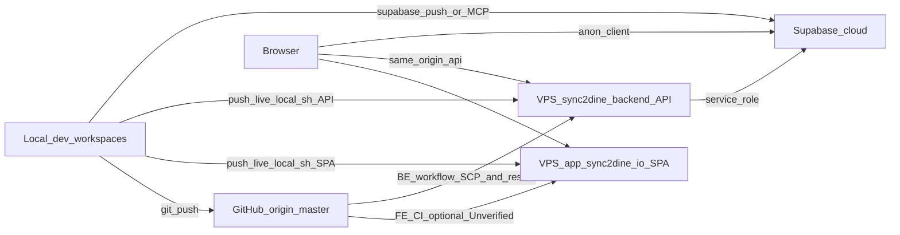
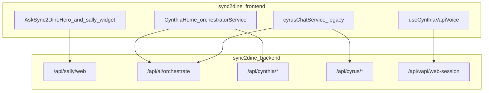
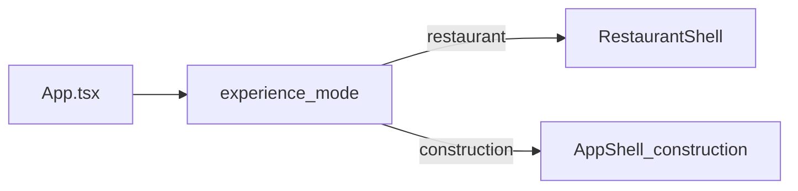

# Sync2Dine architecture diagrams (code-verified)

Generated 2026-07-23 from repository source. Every node maps to a file or mount found in code.  
Full findings: [`ENGINEERING_AUDIT_REPORT.md`](./ENGINEERING_AUDIT_REPORT.md).

## Deploy and data flow

Verified from `scripts/push-live-local.sh`, `sync2dine-backend/.github/workflows/deploy-sync2dine-backend.yml`, FE Supabase client, BE `data-store` / Supabase modules.

Notes:

- Live API port is env-driven; code default in `server/index.ts` is `3001`. Production uses **3011** per deploy docs — live `.env` value **Unverified** in this diagram pass.
- `push-live-local.sh` excludes `.env` and `server/data`. GitHub SCP exclusions are **Unverified**.

## Frontend AI clients ? API

Verified from FE source clients only (no invented Judie web chat).

Judie has marketing UI and platform phone-line APIs; no Judie web-chat client was found.

## Experience shells

Verified from `routes.tsx` / `experience.ts` / shells.

